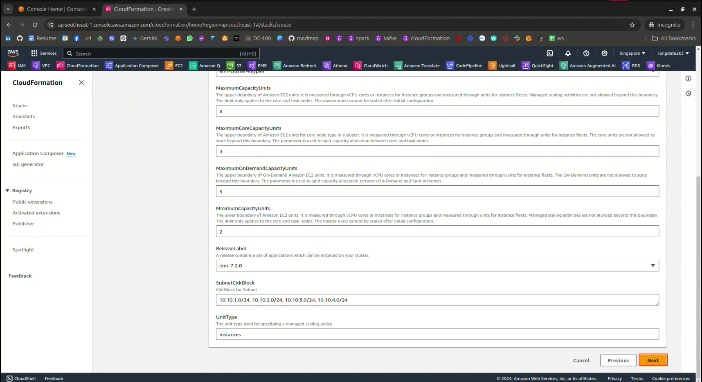
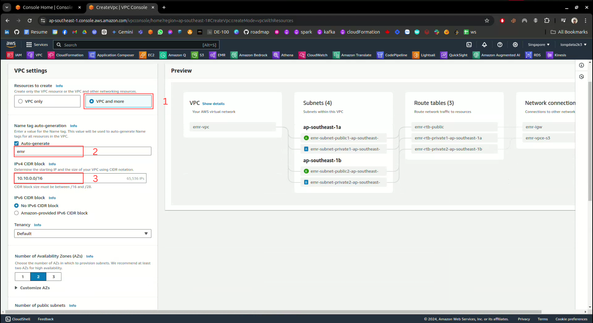
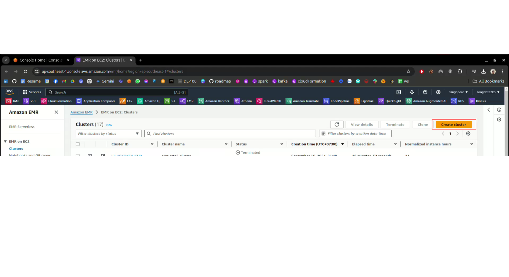
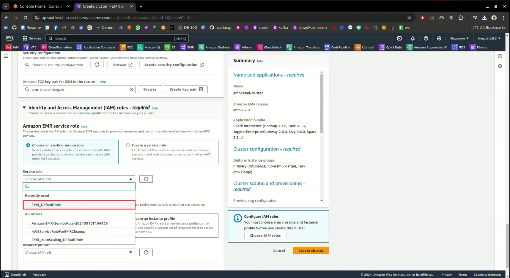
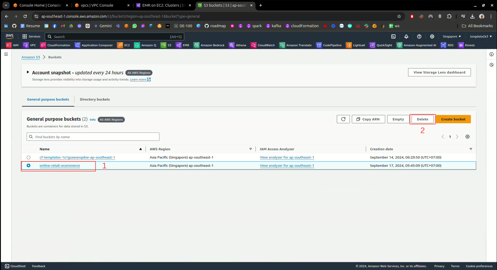

👷 Set up and build a large data processing system with Amazon EMR using Apache Spark and some other services such as Amazon S3, VPC, EC2 on 📦 Amazon Web Services (AWS)

<!--more-->

## 1. 🌍 Introduction
Since launching in 2006, Amazon Web Services has been providing world-leading cloud technologies that help any organization and any individual build solutions to transform industries, communities, and lives for the better.

As part of [Amazon](https://www.aboutamazon.com/about-us), we strive to be Earth’s most customer-centric company. We work backwards from our customers’ problems to provide them with cloud infrastructure that meets their needs, so they can reinvent continuously and push through barriers of what people thought was possible.

Whether they are entrepreneurs launching new businesses, established companies reinventing themselves, non-profits working to advance their missions, or governments and cities seeking to serve their citizens more effectively—our customers trust AWS with their livelihoods, their goals, their ideas, and their data.

### 1.1. Amazon VPC
Amazon Virtual Private Cloud (Amazon VPC) is a **Virtual Private Cloud**—a customized virtual network hosted within the AWS Cloud and isolated from the external world. This concept resembles the design and implementation of a distinct standalone network environment in an on-premise data center, a practice still widely employed across many countries.

Within this dedicated VPC, users possess comprehensive control over their virtual network environment. This control encompasses the initiation and operation of AWS resources, the ability to choose IP address ranges, establish network subnets, and configure routing tables and network gateways. Secure and convenient resource and application access within the VPC is facilitated through both IPv4 and IPv6 protocols.

The term “Region” refers to vast clusters of AWS data centers situated within specific territories. Multiple VPCs can be established within a single region, with each VPC differentiated by its unique IP address space range. The IPv4 address range is defined by selecting a Classless Inter-Domain Routing (CIDR) notation, such as 10.0.0.0/16. Once created, the Amazon VPC address range remains immutable. These ranges can span from as extensive as /16 (equivalent to 65536 available addresses) to as limited as /28 (allowing for 16 available addresses). Crucially, these ranges must not overlap with any other connected networks.

The Amazon VPC service was introduced subsequent to the launch of Amazon EC2. Consequently, AWS provided two distinct networking platforms for a period: EC2-Classic and EC2-VPC. EC2-Classic established a single flat network where all Amazon EC2 instances operated, enabling shared connectivity among AWS clients. However, as of December 2013, AWS exclusively supports EC2-VPC. Each region includes a default VPC along with a default subnet featuring a CIDR block of 172.31.0.0/16.

#### 1.1.1. Subnets
A **subnet** is a segment of the IP address range that you use when provisioning your Amazon VPC. It directly provides the active network range to the AWS resources that may run within it, such as Amazon EC2 and Amazon RDS (Amazon Relational Database Service). Subnets are identified through CIDR blocks (e.g., 10.0.1.0/24 and 192.168.0.0/24), and the subnet’s CIDRs must be within the VPC’s CIDR. The smallest subnet that can be created is /28 (16 IP addresses). AWS reserves the first 4 IP addresses and the last 1 IP address of each subnet for intranet networking purposes. For example, a /28 subnet has 16 available IP addresses, but 5 reserved IPs are used for AWS, leaving 11 usable IP addresses for resources operating within this subnet.

An **Availability Zone (AZ)** is a single or multi-data center located within a Region and identified based on geographical location. Within an AZ, there can be one or more subnets. However, a subnet can only reside in a single AZ and cannot extend to other AZs.

Subnets are categorized as:
  - **Public subnet**: This subnet has a route table (discussed later) that directs traffic within the subnet to the VPC’s Internet Gateway (IGW) (discussed later).
  - **Private subnet**: The opposite of a Public subnet, it lacks a route table directing traffic to the VPC’s IGW.
  - **VPN-only subnet**: This subnet has a route table that directs traffic to Amazon VPC’s Virtual Private Gateway (VPG) (discussed later).

Regardless of the subnet type, the subnet’s internal IP address range is always private. This means that it is not possible to directly connect to addresses within this range from outside the Internet.

#### 1.1.2. Route Table
The **Route Table**, also referred to as the routing table, is responsible for providing routing instructions within a network and is associated with specific subnets.

For instance, in the scenario where a Virtual Private Cloud (VPC) is established with the network layer `10.10.0.0/16`, along with two subnets, `10.10.1.0/24` and `10.10.2.0/24`, each default subnet will be allocated a default route table.

Inside the route table, there will exist a route entry with the following details:

  - **Destination**: `10.10.0.0/16`
  - **Target**: `local`

This particular route entry signifies that resources created within the same VPC can communicate with each other.

#### 1.1.3.Internet Gateway
The **Internet Gateway (IGW)** is a crucial component of Amazon VPC that facilitates communication between resources within the VPC, specifically EC2 instances, and the Internet. The IGW exhibits robust horizontal scalability, along with high levels of redundancy and availability. It operates as a designated target within the Amazon VPC’s routing table, playing a vital role in directing traffic from EC2 instances to the external Internet. This process involves translating the network address of the EC2 instance into its corresponding Public IP address.

More precisely, the EC2 instances located within the VPC are only aware of their assigned Private IP addresses. However, when there is a need to transmit traffic from these EC2 instances to the Internet, the IGW intervenes by translating the originating Private IP address into the Public IP address (or Elastic IP addresses, as discussed later) assigned to the respective EC2 instance. This translation is upheld through a one-to-one mapping, which persists until the Public IP address is released.

Conversely, when the EC2 instances receive incoming traffic from the Internet, the IGW undertakes the task of translating the target address (Public IP address) into the corresponding Private IP address of the EC2 instance. Subsequently, the IGW forwards this traffic into the Amazon VPC.

#### 1.1.4. Gateway Endpoint
Gateway VPC endpoints provide reliable connectivity to Amazon S3 and DynamoDB without requiring an internet gateway or a NAT device for your VPC. Gateway endpoints do not use AWS PrivateLink, unlike other types of VPC endpoints.

Amazon S3 and DynamoDB support both gateway endpoints and interface endpoints. For a comparison of the options, see the following:
 - Types of VPC endpoints for Amazon S3
 - Types of VPC endpoints for Amazon DynamoDB
  
**Pricing**: There is no additional charge for using gateway endpoints.

You can access Amazon S3 and DynamoDB through their public service endpoints or through gateway endpoints. This overview compares these methods.

**Access through an internet gateway**

The following diagram shows how instances access Amazon S3 and DynamoDB through their public service endpoints. Traffic to Amazon S3 or DynamoDB from an instance in a public subnet is routed to the internet gateway for the VPC and then to the service. Instances in a private subnet can't send traffic to Amazon S3 or DynamoDB, because by definition private subnets do not have routes to an internet gateway. To enable instances in the private subnet to send traffic to Amazon S3 or DynamoDB, you would add a NAT device to the public subnet and route traffic in the private subnet to the NAT device. While traffic to Amazon S3 or DynamoDB traverses the internet gateway, it does not leave the AWS network.

**Access through a gateway endpoint**

The following diagram shows how instances access Amazon S3 and DynamoDB through a gateway endpoint. Traffic from your VPC to Amazon S3 or DynamoDB is routed to the gateway endpoint. Each subnet route table must have a route that sends traffic destined for the service to the gateway endpoint using the prefix list for the service. For more information, see AWS-managed prefix lists in the Amazon VPC User Guide.

**Routing**

When you create a gateway endpoint, you select the VPC route tables for the subnets that you enable. The following route is automatically added to each route table that you select. The destination is a prefix list for the service owned by AWS and the target is the gateway endpoint.

| **Destination** | **Target**  |
|:-----------:|:-------:|
| `prefix_list_id` | `gateway_endpoint_id` |


#### 1.1.5. Security Group
- Basic Features of Security Group
  - **Allow Rules Only**: Only Allow rules can be added; Deny rules cannot be added.
  - **Separate Rules for Traffic**: Separate rules can be specified for outgoing and incoming traffic.
  - **Initial Inbound Rules**: A newly created Security group starts with no Inbound rules. Initially, the instance won’t allow any traffic in, requiring the addition of an Inbound rule to enable access.
  - **Default Outbound Rule**: By default, the Security group includes an Outbound rule that permits all traffic to leave the instance. This rule can be modified or replaced with specific Outbound rules to control outgoing traffic originating from the instance. If there’s no Outbound rule, no traffic is allowed to exit the instance.
  - **Stateful Service**: Security groups are stateful services, meaning that if incoming traffic is allowed, outgoing traffic is automatically permitted, and vice versa, regardless of the Outbound rule.
  - **Instance Communication**: Instances can communicate only if they are associated with a Security group that permits connections, or if a Security group associated with the instance contains a rule allowing traffic. The default Security group has default rules allowing all traffic.
  - **Association with Network Interfaces**: Security groups are associated with network interfaces. After initialization, you can change the Security group assigned to an instance, which will also update the Security group for the corresponding primary network interface.

- Security Group Rule
  - A Security group rule is created to grant access to traffic entering or leaving an instance. This access can apply to a specific CIDR or to a Security group in the same VPC, or even to a Security group in another VPC connected by peering.

- Components of Security Group Rule
  - **Inbound Rules**: These include the source of the traffic and the destination port or port range. The source can be another security group, an IPv4 or IPv6 CIDR range, or an IPv4/IPv6 address.
  - **Outbound Rules**: These include the destination of the traffic and the destination port or port range. The destination can be another security group, an IPv4 or IPv6 CIDR range, an IPv4/IPv6 address, or a service identified by a prefix (e.g. igw_xxx) in the prefix ID list (where services are identified by the prefix ID - the name and ID of the available service in the region).
  - **Standard Protocols**: Each protocol has a standard protocol number associated with it. For instance, SSH is associated with port number 22.

### 1.2. Amazon S3
**Amazon Simple Storage Service (Amazon S3)** is an object storage service that provides on-demand scalability, ensuring high levels of data availability, security, and performance. best.

S3 is built to meet the needs of customers of all sizes and industries who can use this service to store and protect any amount of data.

S3 can be used for many use cases such as dataware house, websites, mobile apps, backup and restore, storage, enterprise applications, IoT devices, and data analytics great. In addition, Amazon S3 provides easy-to-use management features, so you can organize your data and configure access controls to meet the specific requirements of your business, organization, and requirements. compliance requirements.

Amazon S3 is designed for 99.999999999% (11 9’s) endurance and stores the data of millions of applications for companies worldwide.

### 1.3. Amazon EMR
### 1.4. Amazon EC2
 - **Amazon EC2** functions similarly to a conventional physical or virtual server, offering rapid initialization, robust resource scalability, and versatile flexibility.
 - **Virtual server**: Divides a physical server into multiple virtual servers to optimize resource utilization.
 - **Amazon EC2** supports a variety of workloads, including web hosting, applications, databases, authentication services, and other tasks typically handled by a standard server.

Amazon Elastic Compute Cloud (Amazon EC2) provides on-demand, scalable computing capacity within the Amazon Web Services (AWS) Cloud. Utilizing Amazon EC2 reduces hardware expenses, enabling faster application development and deployment. It empowers you to launch as many or as few virtual servers as needed, configure security and networking settings, and manage storage resources. Capacity can be increased (scale up) to manage compute-intensive tasks such as monthly or yearly processes or spikes in website traffic. Conversely, when usage subsides, capacity can be reduced (scale down).

The following diagram depicts a fundamental architecture of an Amazon EC2 instance deployed within an Amazon Virtual Private Cloud (VPC) within a specific Availability Zone in the Region. The EC2 instance’s security is governed by a security group, acting as a virtual firewall controlling inbound and outbound traffic. The instance employs a key pair—consisting of a private key stored locally and a public key stored on the instance—to verify the user’s identity. In this setup, the instance is supported by an Amazon EBS volume.

Configuration of Amazon EC2 is obligatory, with configuration determined by the chosen EC2 instance types.

`Instance type` influences the following attributes:

 - CPU (Intel / AMD / ARM (Graviton 1/2/3) / GPU)
 - Memory
 - Network
 - Storage
  
`AMI` / `Backup` / `Key Pair`:
 - Employing **AMI (Amazon Machine Image)** enables the simultaneous provisioning of one or more **EC2 Instances**.
 - **AMI** options encompass those from AWS, AWS Marketplace, and custom AMIs created from existing **EC2 Instances**.
 - **AMI** includes **root OS volumes**; usage rights specify the associated AWS account, and **mapping EBS volumes** are assigned to EC2 Instances.
 - **EC2 instances** can be backed up via the creation of snapshots.
 - **Key pairs (public key and private key)** are employed to encrypt login information for **EC2 Instances**.

**Amazon EC2** offers the following `prominent features`:
 - Virtual servers.
 - Preconfigured templates for your instances containing necessary components like the operating system and additional software.
 - Various configurations including CPU, memory, storage, networking capacity, and graphics hardware for your instances.
 - Secure login credentials for your instances. AWS retains the public key while you keep the private key in a secure location.
 - Storage volumes for temporary data that gets deleted upon instance stoppage, hibernation, or termination.
 - Persistent storage volumes for your data utilizing Amazon Elastic Block Store (Amazon EBS).
 - Multiple physical locations accommodating your resources such as instances and Amazon EBS volumes.
 - A virtual firewall permitting you to define protocols, ports, source IP ranges that can access your instances, and destination IP ranges your instances can connect to.
 - Static IPv4 addresses for dynamic cloud computing.
 - Metadata that you can generate and assign to your Amazon EC2 resources.
 - Virtual networks that you can establish, offering logical isolation from the wider AWS Cloud. Optionally, these virtual networks can be linked to your own network.

## 2. 📊 Present the problem
Collecting and processing huge amounts of data is always an issue that businesses are most concerned about because of the value it brings.

  - **Rapid Data Growth**: Businesses today are generating and collecting vast amounts of data from diverse sources such as customer interactions, social media, sensors, and transactional systems.
  - **Big Data Opportunities and Challenges**: This massive amount of data, known as "big data," presents significant opportunities for insights but also poses challenges in handling and processing effectively.
  - **Data-Driven Decision Making**: Companies must process and analyze big data to make informed, data-driven decisions that improve strategy and performance.
  - **Operational Optimization**: Efficient data processing allows businesses to streamline operations, improve efficiency, and reduce costs by identifying patterns and trends.
  - **Personalization and Customer Insights**: Big data helps businesses personalize customer experiences, better understand customer needs, and improve satisfaction.
  - **Future Trend Prediction**: Analyzing large data sets can provide predictive insights that allow businesses to anticipate future trends and make proactive decisions.
  - **Technological Investments**: To handle the complexity and volume of big data, companies are investing in advanced technologies like cloud computing, machine learning, and distributed data processing systems.
  - **Competitive Necessity**: In the digital age, the ability to harness big data is essential for businesses to stay competitive and thrive in the market.

Therefore, designing, building and managing big data processing systems is extremely important today for every business.


## 3. 🔦 Architecture

<!-- <div style="text-align: center;">
    
</div> -->


- 📦 Technology and Services:
   - `S3` 
   - `EMR` 
   - `EC2` 
   - `CloudFormation`
   - `Apache Spark` 
   - `VPC` 
   - `IAM`

## 4. 📑 Preparation
### 4.1. Data Source
This is a transnational data set which contains all the transactions occurring between 01/12/2010 and 09/12/2011 for a UK-based and registered non-store online retail.The company mainly sells unique all-occasion gifts. Many customers of the company are wholesalers.


Download here: [Kaggle - Online Retail Dataset](https://www.kaggle.com/datasets/ulrikthygepedersen/online-retail-dataset)

### 4.2. PySpark Script
```python
import argparse
from datetime import datetime

from pyspark.sql import SparkSession
from pyspark.sql import DataFrame
from pyspark.sql import functions as F
from pyspark.sql import types as T
from pyspark.sql.window import Window


def transform_calc_data(data_source: str, output_uri: str) -> None:
    """
    Processes sample food establishment inspection data and queries the data to find 
    the top 10 establishments with the most Red violations from 2006 to 2020.

    :param data_source: The URI of your food establishment data CSV, 
    such as 's3://DOC-EXAMPLE-BUCKET/food-establishment-data.csv'.
    :param output_uri: The URI where output is written, such as 
    's3://DOC-EXAMPLE-BUCKET/restaurant_violation_results'.
    """
    
    with SparkSession.builder.appName("emr-cluster-{}".format(
        datetime.today())).getOrCreate() as spark:
                                 
        # Load the Online Retail CSV data
        if data_source is not None:
            df:DataFrame = spark.read.csv(data_source, header=True, inferSchema=True)
        # Log into EMR stdout
        print(f"Dataset have shape: {(df.count(), df.columns)}")
        
        # Rename Columns
        col_renames = {
            'InvoiceNo': 'OrderID', 
            'StockCode': 'ProductID', 
            'InvoiceDate': 'OrderDate'
        }
        for old_name, new_name in col_renames.items():
            df = df.withColumnRenamed(old_name, new_name)
        
        # Remove spaces
        df = df.withColumn("OrderDate", F.trim(F.col("OrderDate"))) 
            
        # Change data type for column OrderDate
        DATE_FORMAT = ["M/d/yyyy H:mm", "M/d/yyyy H:mm", "M/d/yyyy H:mm"]
        df = df.withColumn(
            "OrderDate",
            F.coalesce(
                F.to_timestamp(F.col("OrderDate"), DATE_FORMAT[0]),
                F.to_timestamp(F.col("OrderDate"), DATE_FORMAT[1]),
                F.to_timestamp(F.col("OrderDate"), DATE_FORMAT[2])
            )
        )
        # Feature Engineering
        TIME_FORMAT = "HH:mm"
        df = df.withColumn("Day", F.dayofmonth("OrderDate"))
        df = df.withColumn("Month", F.month("OrderDate"))
        df = df.withColumn("Year", F.year("OrderDate"))
        df = df.withColumn("HourMinute", F.date_format("OrderDate", TIME_FORMAT))
            
        # Find Start value for CustomerID
        max_customer_id = df.agg(F.max("CustomerID")).collect()[0][0]
        
        # Get a list of OrderIDs with a missing (null) CustomerID value
        order_ids_with_null_customer = df.filter(F.col("CustomerID").isNull()).select("OrderID").distinct()
        
        # Create a sequence number column for OrderIDs with null CustomerID value
        window_spec = Window.orderBy("OrderID")
        order_ids_with_new_customer = order_ids_with_null_customer.withColumn(
            "new_CustomerID", F.row_number().over(window_spec) + max_customer_id)
        
        # Replace null values ​​of the CustomerID column with new values ​​based on OrderID
        df = df.join(order_ids_with_new_customer, "OrderID", "left").withColumn(
            "CustomerID", F.coalesce(F.col("CustomerID"), F.col("new_CustomerID"))
        ).drop("new_CustomerID")
        
        # Use na.fill() to replace null values ​​of the Description column
        df = df.withColumn("Description", F.lower(F.col("Description")))
        df = df.na.fill({"Description": "unknown"})
        
        # Drop NA and Duplicate
        df = df.dropna()
        df = df.dropDuplicates()
        
        # Log into EMR stdout
        print(f"Dataset have shape: {(df.count(), df.columns)}")
        
        # Write our results as parquet files
        df.write.option("header", "true").mode("overwrite").parquet(output_uri)
        
        
if __name__ == "__main__":
    parser = argparse.ArgumentParser()
    parser.add_argument('--data_source', help="The URI for you Parquet online retail data, like an S3 bucket location.")
    parser.add_argument('--output_uri', help="The URI where output is saved, like an S3 bucket location.")
    args = parser.parse_args()

    transform_calc_data(args.data_source, args.output_uri)
```

For beginners, `Python` is always the top choice because of its easy-to-understand, easy-to-learn syntax and versatility, it can be used for web or data-related work.


## 5. 📡 Setup Infrastructure
We can choose one of two ways to set up the infrastructure, I will guide you through both of them below.

| **Setup by**             | **Advantage**                         | **Disadvantages**         |
|:-------------------- |:---------------------------------:|:---------------------:|
| `Mamual`             | Intuitive and easy to use         | Difficult to manage when expanding                 |
|                      | Flexible                          | Cannot be reused
|                      | No deep code knowledge required   | Difficulty in version control
|                      |                                   | No automation
| | |
| `CloudFormation`     | Automation and reuse        |  Requires in-depth knowledge                 |
| | Version management and history | Lacks immediate flexibility
| | Large scale | Errors that are difficult to detect may occur
| | CI/CD integration |
| | Complex resource management |


### 5.1. Setup with CloudFormation
```yaml key: value list:

AWSTemplateFormatVersion: "2010-09-09"
Description: Setup infrastructure for batch processing with Amazon EMR on Amazon Web Services (AWS)

Parameters:
  SubnetCidrBlock:
    Description: CidrBlock for Subnet
    Type: CommaDelimitedList
    Default: "10.10.1.0/24, 10.10.2.0/24, 10.10.3.0/24, 10.10.4.0/24"

  InstanceType:
    Description: WebServer EC2 instance type (has default, AllowedValues)
    Type: String
    Default: m5.xlarge
    AllowedValues:
      - m5.2xlarge
      - m5.xlarge
    ConstraintDescription: must be a valid EC2 instance type.

  ReleaseLabel:
    Description: A release contains a set of applications which can be installed on your cluster.
    Type: String
    Default: emr-7.2.0
    AllowedValues:
      - emr-7.2.0
      - emr-7.1.0
      - emr-7.0.0
      - emr-6.12.0
      - emr-6.13.0
      - emr-6.14.0
      - emr-6.15.0
    ConstraintDescription: ReleaseLabel is invalid

  KeyName:
    Description: Name of an existing EC2 KeyPair to enable SSH access to the instances. Linked to AWS Parameter
    Type: AWS::EC2::KeyPair::KeyName
    ConstraintDescription: must be the name of an existing EC2 KeyPair.

  MinimumCapacityUnits:
    Description: |
      The lower boundary of Amazon EC2 units. It is measured through vCPU cores or 
      instances for instance groups and measured through units for instance fleets. 
      Managed scaling activities are not allowed beyond this boundary. 
      The limit only applies to the core and task nodes. 
      The master node cannot be scaled after initial configuration.
    Type: String
    Default: 2

  MaximumCapacityUnits:
    Description: |
      The upper boundary of Amazon EC2 units. It is measured through vCPU cores or instances for instance groups 
      and measured through units for instance fleets. Managed scaling activities are not allowed beyond this boundary. 
      The limit only applies to the core and task nodes. The master node cannot be scaled after initial configuration.
    Type: String
    Default: 8

  MaximumCoreCapacityUnits:
    Description: |
      The upper boundary of Amazon EC2 units for core node type in a cluster. 
      It is measured through vCPU cores or instances for instance groups and measured through units for instance fleets. 
      The core units are not allowed to scale beyond this boundary. The parameter is used to split capacity allocation between core and task nodes.
    Type: String
    Default: 3

  MaximumOnDemandCapacityUnits:
    Description: |
      The upper boundary of On-Demand Amazon EC2 units. It is measured through vCPU cores or instances for instance groups and measured through units for instance fleets. 
      The On-Demand units are not allowed to scale beyond this boundary. The parameter is used to split capacity allocation between On-Demand and Spot Instances.
    Type: String
    Default: 5

  UnitType:
    Description: The unit type used for specifying a managed scaling policy.
    Type: String
    Default: Instances
    ConstraintDescription: is invalid

Resources:
  # Amazon S3
  s3:
    Type: AWS::S3::Bucket
    Properties:
      BucketName: online-retail-ecommerce
      VersioningConfiguration:
        Status: Enabled
      Tags:
        - Key: name
          Value: Online Retail Ecommerce

  # Amazon VPC
  Vpc:
    Type: AWS::EC2::VPC
    Properties:
      CidrBlock: 10.10.0.0/16
      EnableDnsSupport: true
      EnableDnsHostnames: true
      InstanceTenancy: default
      Tags:
        - Key: name
          Value: Retail Vpc

  # Public Subnet
  PublicSubnet1:
    Type: AWS::EC2::Subnet
    Properties:
      VpcId: !Ref Vpc
      AvailabilityZone: ap-southeast-1a
      CidrBlock: !Select [0, !Ref SubnetCidrBlock]
      MapPublicIpOnLaunch: true
      Tags:
        - Key: name
          Value: Public Subnet 1

  # S3 Gateway Endpoint
  S3GatewayEndpoint:
    Type: AWS::EC2::VPCEndpoint
    Properties:
      VpcId: !Ref Vpc
      VpcEndpointType: Gateway
      ServiceName: !Sub com.amazonaws.ap-southeast-1.s3
      PolicyDocument:
        Version: 2012-10-17
        Statement:
          - Sid: Allow-access-to-specific-bucket
            Effect: Allow
            Principal: '*'
            Action:
              - s3:GetObject
              - s3:PutObject
              - s3:DeleteObject
              - s3:ListBucket
            Resource:
              - arn:aws:s3:::online-retail-ecommerce/*
              - arn:aws:s3:::online-retail-ecommerce
      RouteTableIds:
        - !Ref RouteTable
    DependsOn: s3

  # Internet Gateway
  InternetGateway:
    Type: AWS::EC2::InternetGateway
    Properties:
      Tags:
        - Key: Name
          Value: Internet Gateway

  # Internet Gateway Attachment
  VpcGatewayAttachment:
    Type: AWS::EC2::VPCGatewayAttachment
    Properties:
      VpcId: !Ref Vpc
      InternetGatewayId: !Ref InternetGateway

  # Route Table
  RouteTable:
    Type: AWS::EC2::RouteTable
    Properties:
      VpcId: !Ref Vpc
      Tags:
        - Key: name
          Value: Route Table Public

  # Route Table Subnet Associate
  RouteTableSubnetAssociate1:
    Type: AWS::EC2::SubnetRouteTableAssociation
    Properties:
      RouteTableId: !Ref RouteTable
      SubnetId: !Ref PublicSubnet1

  # Route
  Route:
    Type: AWS::EC2::Route
    Properties:
      RouteTableId: !Ref RouteTable
      DestinationCidrBlock: 0.0.0.0/0
      GatewayId: !Ref InternetGateway
    DependsOn: VpcGatewayAttachment

  # EMR Cluster
  Emr:
    Type: AWS::EMR::Cluster
    Properties:
      Name: emr-retail-cluster
      ReleaseLabel: !Ref ReleaseLabel
      Applications:
        - Name: Spark
        - Name: Livy
        - Name: Hadoop
        - Name: JupyterEnterpriseGateway
        - Name: Hive
      Instances:
        MasterInstanceGroup:
          InstanceCount: 1
          InstanceType: !Ref InstanceType
          Market: ON_DEMAND
          Name: Primary
        CoreInstanceGroup:
          InstanceCount: 1
          InstanceType: !Ref InstanceType
          Market: ON_DEMAND
          Name: Core
        TaskInstanceGroups:
          - InstanceCount: 1
            InstanceType: !Ref InstanceType
            Market: ON_DEMAND
            Name: Task-1
          - InstanceCount: 1
            InstanceType: !Ref InstanceType
            Market: ON_DEMAND
            Name: Task-2
        Ec2SubnetId: !Ref PublicSubnet1
        Ec2KeyName: !Ref KeyName
        AdditionalMasterSecurityGroups:
          - !Ref EmrSG
      ServiceRole: EMR_DefaultRole
      JobFlowRole: EMR_EC2_DefaultRole
      VisibleToAllUsers: true
      LogUri: s3://online-retail-ecommerce/logs/
      ManagedScalingPolicy:
        ComputeLimits:
          MinimumCapacityUnits: !Ref MinimumCapacityUnits
          MaximumCapacityUnits: !Ref MaximumCapacityUnits
          MaximumCoreCapacityUnits: !Ref MaximumCoreCapacityUnits
          MaximumOnDemandCapacityUnits: !Ref MaximumOnDemandCapacityUnits
          UnitType: !Ref UnitType
      # SecurityConfiguration: 
      Tags:
        - Key: name
          Value: emr retail cluster

  # Emr Security Group
  EmrSG:
    Type: AWS::EC2::SecurityGroup
    Properties:
      VpcId: !Ref Vpc
      GroupName: Emr Cluster - SG
      GroupDescription: Allow SSH and Ping for servers in the Emr Cluster
      SecurityGroupIngress:
        - IpProtocol: tcp
          FromPort: 22
          ToPort: 22
          CidrIp: 0.0.0.0/0
      SecurityGroupEgress:
        - IpProtocol: -1
          CidrIp: 0.0.0.0/0
      Tags:
        - Key: name
          Value: Emr Cluster SG
  
  emrRole:
    Type: AWS::IAM::Role
    Properties:
      AssumeRolePolicyDocument:
        Version: 2008-10-17
        Statement:
          - Sid: ''
            Effect: Allow
            Principal:
              Service: !Ref ElasticMapReducePrincipal
            Action: sts:AssumeRole
      Path: /
      ManagedPolicyArns:
        - arn:aws:iam::aws:policy/service-role/AmazonElasticMapReduceRole

  emrEc2Role:
    Type: AWS::IAM::Role
    Properties:
      AssumeRolePolicyDocument:
        Version: 2008-10-17
        Statement:
          - Sid: ''
            Effect: Allow
            Principal:
              Service: !Ref Ec2Principal
            Action: sts:AssumeRole
      Path: /
      ManagedPolicyArns:
        - arn:aws:iam::aws:policy/service-role/AmazonElasticMapReduceforEC2Role

  emrEc2InstanceProfile:
    Type: AWS::IAM::InstanceProfile
    Properties:
      Path: /
      Roles:
        - !Ref emrEc2Role
```

On the search bar, enter the keyword CloudFormation, then click `CloudFormation` Service.


Next we click `Create Stack`


In the `Create Stack` interface, select `existing template`, then select `upload template`, continue to click `choose file` to select the file, after uploading the correct file you want, click `Next`.


Enter the `Stack name` and select `Instance type`.


Select the previously created `Key Pair`.


Các thông số khác ta để nguyên và bấm `Next`.


Continue clicking `Next` and finally click `Submit`.


We can see the `Services` and `features` being initialized according to the template we specified, we can click on the refresh icon to update the status.


Now the `Stack` has been created successfully.


### 5.2. Manual Setup
#### 5.2.1. Create S3 Bucket
First we need to select `Region`, Here I choose `Singapore`


We search for the `S3` service in the search bar, then click on `S3`


After entering the `S3` service, click `Create Bucket`
.png)

Next we enter the `bucket name`
.png)

Enable `Bucket Versioning`
.png)

Finally, click `Create Bucket` to initialize the bucket
.png)

After completing the above operations, we will create a bucket in the region Singapore (ap-southeast-1)
.png)

#### 5.2.2. Upload Resources
Click on the previously created bucket, then select `Create folder`
.png)

In the `Folder name` field, fill in `logs`, specify the encryption key for the folder, then click `Create folder`
.png)

EMR Cluster needs a path to a location in S3 to perform logging for cluster activities such as tasks, nodes,...


We do the same with the `input`, `output` and `scripts` folders
.png)
.png)
.png)

After completion, we have 4 folders as below
.png)

In the `input` folder, we upload input data for `EMR Cluster`, first click `upload`
.png)

then select `add files`
.png)

then select the data file downloaded from the link above
.png)

After confirming that we have added the correct data file, we select `upload`
.png)

We do the same with the `scripts` folder, this folder will contain code that helps `transform` and `calculate` according to the needs and purposes of data use.
.png)

In addition, the `output` folder is used to contain cluster output data

#### 5.2.3. Create VPC
In the search bar, search for the keyword `VPC`, then click on `VPC service`.

In the VPC console, click `Create VPC`.


Choose `VPC and More`, enter a name for the VPC in the `Auto-generate` field, next fill in the `IPv4 CIDR block` with the value `10.10.0.0/16`


Next we choose the `AZ` number as 1, the `Public Subnet` number as 1, the `Private Subnet` number as 0,Then we choose `S3 Gateway` so that the `Cluster` can `communicate` with `S3 Bucket` via the internal network


Finally, click Create VPC


Below are the `features` built with `VPC`


##### 5.2.3.1. Subnets
We can see that the `VPC` was created with a `Public Subnet` in `AZ` `ap-southeast-1a` with an `IPv4 CIDR` of `10.10.0.0/20`


Detailed parameters of `Public Subnet`


##### 5.2.3.2. Route Table
We can see that in addition to the `default route`, we have a route with `Destination` of `0.0.0.0/0` and `Target` of `Internet Gateway ID`, allowing services located in the Public Subnet to go out to the Internet.


`Public Subnet` and `Route Table` are `associated` with each other, helping to specify routes for the public subnet


##### 5.2.3.3. Internet Gateway
The `Internet Gateway` is created and `attached` to the `VPC` we created above and `routed` in the `route table`


##### 5.2.3.4. VpcEnpoint
We can see that a `VpcEndpoint` is created under the `VPC` we created above with the `S3` service and the `Endpoint Type` is of type `Gateway`, this helps the `EMR Cluster` to communicate with the `S3 Bucket` through the internal network.


##### 5.2.3.5. Security Group
A `Security Group` is created belonging to the `VPC` we created above


We can see that `Inbound rules` and `Outbound rules` allow `All traffic` to enter and exit



`Inbound` and `Outbound` are configured with `All traffic` which is not a security issue, which we need to consider and handle.


#### 5.2.4. Create KeyPair
In EC2 Console choose `Key pair`


Next, click `Create Key pair`


Enter the `Key pair name`, then click `Create Key pair`.


We get a new `key pair`.


#### 5.2.5. Create and Add Roles
We will create `Roles` using `CLI`, first we need to `export environment variables`.
```Bash
export AWS_ACCESS_KEY_ID=KJFKLSJJFKSLDJSLDJK
export AWS_SECRET_ACCESS_KEY=SHJKLSDKF+KSJDFKJSLDKJF+SJKS+LKSJLK
```

We run the following command to start creating EMR Roles.
```bash
aws emr create-default-roles
```
Run the command below to check the roles that have been created.
```bash
aws iam list-roles | grep 'EMR_DefaultRole\ | EMR_EC2_DefaultRole'
```

We will check again in `Amazon IAM` to make sure the roles have been created.
In IAM console, choose Roles


We see that the necessary Roles have been created.


#### 5.2.6. Create EMR Cluster
On the search bar, search with the keyword `EMR`, then click `EMR service`


In the `EMR` console, select `Create cluster`


First we enter a name for the `cluster`, next we select the latest `EMR Release` (currently `emr-7.2.0`), then we select Application (`Spark`).


We select `Amazon Linux release`, automatically applying the latest updated version.


Choose `Instance Type` for `Master Node`


Next we choose `Instance Type` for `Worker Node` including 1 `core` and 1 `task`


Set the number of `cores` and `tasks`, here we leave 1 core and 1 task, then we choose `VPC` and `Subnet` for `EMR Cluster`.


We select the `VPC` and `Subnet` that were previously created for the `cluster`.


We specify the path to the `logs` directory in the `s3 bucket` for the `cluster`.


Choose the `keypair` for the `cluster` we created above


Specify the `Service Role` and `EC2 Instance profile` that we created and added above



Confirm the information and click `Create Cluster`.


At this point, the `Cluster` will be in `Starting` state, after a few minutes it will switch to `waiting` state (At this point it is ready to receive jobs and tasks)


## 6. 👷 Submit Work to EMR Cluster
When the `Cluster` is in the `Waiting` state, we will perform `Submit work` for the `EMR Cluster` by clicking on the `Steps` tab.


Next we choose `Add step`.


In the `Type` section, select `Spark application`, in the `Name` field, fill in the `step name`, and `Deploy mode`, select `Cluster mode`.


In `Application location`, point to the folder containing the `PySpark script` containing the calculation and data conversion logic. In the `Arguments` section, fill in the following arguments:

```bash
--data-source s3://online-retail-ecommerce/input/OnlineRetail.csv 
--output-uri s3://online-retail-ecommerce/output/
```

In `step action` we choose `continue`.
Finally we click `Add step`.


After creating the `step`, it will now have a `Pending` status. You can click `Refresh table` to update the step's status.


After 20 to 25 seconds, the step has moved to the `Running` state, which means the `EMR Cluster` is performing tasks.


After 50 seconds, the step has moved to the `Completed` state, which means the `EMR Cluster` has completed its assigned work.


## 7. 🔎 View Results
### 7.1. View Output
After `EMR Cluster` completes its work, we can move to the `output` folder to see the output results.



The output data is divided into multiple files while the input is only 1 file. This is because Spark automatically splits the data to perform parallel calculations and processing, helping to increase performance when working with data. big material.


### 7.2. View Data
To check if the data has actually been processed, you can download one of the files in the output folder, by checking the file you want to download and clicking download. After downloading you can view the data. This is before and after the data is processed.


### 7.2. View Logs
We have specified the `Logs` location for `EMR Cluster`, so it will perform Logs during data processing.


## 8. 🗑 Clean Up
### 8.1. Terminate EMR CLuster
In the `EMR Console`, we select the cluster to terminate, then we click `Terminate`.


The cluster is now in `Terminating` state.


The status changes to `Terminated`, meaning the cluster has successfully terminated.


### 8.2. Delete VPC
Trong Tab `Your VPCs` ta chọn `VPC` cần xóa, sau đó chọn `Delete VPC`.


We can see that when we delete a `VPC`, the `features` created with it will also be deleted, this helps clean up resources faster, features include `Internet Gateway`, `Route Table`, `Security Group`, `Subnet`, `VpcEnpoint`. Then we enter `delete` to confirm deleting the VPC, finally click `Delete`.


### 8.3. Delete S3 Bucket
Select the `Bucket` you want to delete, then click `Empty` to delete the bucket's contents.


Enter `permanently delete` to confirm deletion of the content, then click `Empty`.


We re-select the `Bucket` that just deleted its contents and click `Delete`.


Enter the `bucket name` to confirm deletion then click `Delete bucket`.


<!-- 

## 1 Requirements

Thanks to the simplicity of Hugo, [Hugo](https://gohugo.io/) is the only dependency of this theme.

Just install latest version of [:(fa-regular fa-file-archive fa-fw): Hugo (> 0.110.0)](https://gohugo.io/getting-started/installing/) for your OS (**Windows**, **Linux**, **macOS**).


Since [Markdown Render Hooks](https://gohugo.io/getting-started/configuration-markup#markdown-render-hooks) were introduced in [Hugo Christmas Edition](https://gohugo.io/news/0.62.0-relnotes/), and some image sources are using webp which was introduced in [0.84.0](https://github.com/gohugoio/hugo/releases/tag/v0.84.0) and also we changed [config.toml to hugo.toml](https://github.com/khusika/FeelIt/commit/f965cb91df2b2e90e667e3cf152fffd73d885906), this theme only supports Hugo versions above **0.110.0**.



Since some features of this theme need to processes :(fa-brands fa-sass fa-fw): SCSS to :(fa-brands fa-css3 fa-fw): CSS, it is recommended to use Hugo **extended** version for better experience.


## 2 Installation

The following steps are here to help you initialize your new website. If you don’t know Hugo at all, we strongly suggest you learn more about it by following this [great documentation for beginners](https://gohugo.io/getting-started/quick-start/).

### 2.1 Create Your Project

Hugo provides a `new` command to create a new website:

```bash
hugo new site my_website
cd my_website
```

### 2.2 Install the Theme

The **FeelIt** theme’s repository is: [https://github.com/khusika/FeelIt](https://github.com/khusika/FeelIt).

You can download the [latest release :(fa-regular fa-file-archive fa-fw): .zip file](https://github.com/khusika/FeelIt/releases) of the theme and extract it in the `themes` directory.

Alternatively, clone this repository to the `themes` directory:

```bash
git clone https://github.com/khusika/FeelIt.git themes/FeelIt
```

Or, create an empty git repository and make this repository a submodule of your site directory:

```bash
git init
git submodule add https://github.com/khusika/FeelIt.git themes/FeelIt
```

### 2.3 Basic Configuration {#basic-configuration}

The following is a basic configuration for the FeelIt theme:

```toml
baseURL = "http://example.org/"
# [en, zh-cn, fr, ...] determines default content language
defaultContentLanguage = "en"
# language code
languageCode = "en"
title = "My New Hugo Site"

# Change the default theme to be use when building the site with Hugo
theme = "FeelIt"

[params]
  # FeelIt theme version
  version = "1.0.X"

[menu]
  [[menu.main]]
    identifier = "posts"
    # you can add extra information before the name (HTML format is supported), such as icons
    pre = ""
    # you can add extra information after the name (HTML format is supported), such as icons
    post = ""
    name = "Posts"
    url = "/posts/"
    # title will be shown when you hover on this menu link
    title = ""
    weight = 1
  [[menu.main]]
    identifier = "tags"
    pre = ""
    post = ""
    name = "Tags"
    url = "/tags/"
    title = ""
    weight = 2
  [[menu.main]]
    identifier = "categories"
    pre = ""
    post = ""
    name = "Categories"
    url = "/categories/"
    title = ""
    weight = 3

# Markup related configuration in Hugo
[markup]
  # Syntax Highlighting (https://gohugo.io/content-management/syntax-highlighting)
  [markup.highlight]
    # false is a necessary configuration (https://github.com/khusika/FeelIt/issues/158)
    noClasses = false
```


When building the website, you can set a theme by using `--theme` option. However, we suggest you modify the configuration file (**hugo.toml**) and set the theme as the default.


### 2.4 Create Your First Post

Here is the way to create your first post:

```bash
hugo new posts/first_post.md
```

Feel free to edit the post file by adding some sample content and replacing the title value in the beginning of the file.


By default all posts and pages are created as a draft. If you want to render these pages, remove the property `draft: true` from the metadata, set the property `draft: false` or add `-D`/`--buildDrafts` parameter to `hugo` command.


### 2.5 Launching the Website Locally

Launch by using the following command:

```bash
hugo serve
```

Go to `http://localhost:1313`.



When you run `hugo serve`, when the contents of the files change, the page automatically refreshes with the changes.



Since the theme use `.Scratch` in Hugo to implement some features,
it is highly recommended that you add `--disableFastRender` parameter to `hugo server` command for the live preview of the page you are editing.

```bash
hugo serve --disableFastRender
```


### 2.6 Build the Website

When your site is ready to deploy, run the following command:

```bash
hugo
```

A `public` folder will be generated, containing all static content and assets for your website. It can now be deployed on any web server.


The website can be automatically published and hosted with [Netlify](https://www.netlify.com/) (Read more about [Automated HUGO deployments with Netlify](https://www.netlify.com/blog/2015/07/30/hosting-hugo-on-netlifyinsanely-fast-deploys/)).
Alternatively, you can use [AWS Amplify](https://gohugo.io/hosting-and-deployment/hosting-on-aws-amplify/), [Github pages](https://gohugo.io/hosting-and-deployment/hosting-on-github/), [Render](https://gohugo.io/hosting-and-deployment/hosting-on-render/) and more...


## 3 Configuration

### 3.1 Site Configuration {#site-configuration}

In addition to [Hugo global configuration](https://gohugo.io/overview/configuration/) and [menu configuration](#basic-configuration), **FeelIt** lets you define the following parameters in your site configuration (here is a `hugo.toml`, whose values are default).

Please open the code block below to view the complete sample configuration :(fa-regular fa-hand-point-down fa-fw)::

```toml
[params]
  #  FeelIt theme version
  version = "1.0.X"
  # site description
  description = "This is My New Hugo Site"
  # site keywords
  keywords = ["Theme", "Hugo"]
  # site default theme ("light", "dark", "auto")
  defaultTheme = "auto"
  # public git repo url only then enableGitInfo is true
  gitRepo = ""
  #  which hash function used for SRI, when empty, no SRI is used
  # ("sha256", "sha384", "sha512", "md5")
  fingerprint = ""
  #  date format
  dateFormat = "2006-01-02"
  # website images for Open Graph and Twitter Cards
  images = ["/logo.png"]
  #  whether to enable CSS and JS source mapping
  SourceMap = true

  # PWA config
  [params.pwa]
    # whether to enable PWA support
    enable = true
    # service-worker version
    version = "1.0.2"

  #  App icon config
  [params.app]
    # optional site title override for the app when added to an iOS home screen or Android launcher
    title = "FeelIt"
    # whether to omit favicon resource links
    noFavicon = false
    # modern SVG favicon to use in place of older style .png and .ico files
    svgFavicon = ""
    # Android browser theme color
    themeColor = "#ffffff"
    # Safari mask icon color
    iconColor = "#5bbad5"
    # Windows v8-10 tile color
    tileColor = "#da532c"

  #  Search config
  [params.search]
    enable = true
    # type of search engine ("lunr", "algolia")
    type = "lunr"
    # max index length of the chunked content
    contentLength = 4000
    # placeholder of the search bar
    placeholder = ""
    #  max number of results length
    maxResultLength = 10
    #  snippet length of the result
    snippetLength = 30
    #  HTML tag name of the highlight part in results
    highlightTag = "em"
    #  whether to use the absolute URL based on the baseURL in search index
    absoluteURL = false
    [params.search.algolia]
      index = ""
      appID = ""
      searchKey = ""

  # Header config
  [params.header]
    # desktop header mode ("fixed", "normal", "auto")
    desktopMode = "fixed"
    # mobile header mode ("fixed", "normal", "auto")
    mobileMode = "auto"
    #  Header title config
    [params.header.title]
      # URL of the LOGO
      logo = ""
      # title name
      name = ""
      # you can add extra information before the name (HTML format is supported), such as icons
      pre = ""
      # you can add extra information after the name (HTML format is supported), such as icons
      post = ""
      #  whether to use typeit animation for title name
      typeit = false
      #  whether to show RSS icon
      rss = true

  # Footer config
  [params.footer]
    enable = true
    #  Custom content (HTML format is supported)
    custom = ''
    #  whether to show Hugo and theme info
    hugo = true
    #  whether to show copyright info
    copyright = true
    #  whether to show the author
    author = true
    # Site creation time
    since = 2019
    # ICP info only in China (HTML format is supported)
    icp = ""
    # license info (HTML format is supported)
    license = '<a rel="license external nofollow noopener noreffer" href="https://creativecommons.org/licenses/by-nc/4.0/" target="_blank">CC BY-NC 4.0</a>'

  #  Section (all posts) page config
  [params.section]
    # special amount of posts in each section page
    paginate = 20
    # date format (month and day)
    dateFormat = "01-02"
    # amount of RSS pages
    rss = 10

  #  List (category or tag) page config
  [params.list]
    # special amount of posts in each list page
    paginate = 20
    # date format (month and day)
    dateFormat = "01-02"
    # amount of RSS pages
    rss = 10

  # 
  [params.about]
    # whether to enable profile on about page
    # depends on .Site.Params.home.profile.enable
    enable = true
    # whether to enable param layout
    param = true
    # title for param layout
    paramTitle = "Personal Information"
    # general description of your site
    # can be write with markdown style
    description = "[FeelIt](https://github.com/khusika/FeelIt) is a **clean**, **elegant** but **advanced** blog theme for [Hugo](https://gohugo.io/) developed by [Khusika](https://khusika.dev). It is based on the original [LoveIt Theme](https://github.com/dillonzq/LoveIt), [LeaveIt Theme](https://github.com/liuzc/LeaveIt), and [KeepIt Theme](https://github.com/Fastbyte01/KeepIt)."
    # description of your status
    [[params.about.status]]
      faIcon = "fa-solid fa-building"
      title = "Company"
      desc = "FeelIt"
    [[params.about.status]]
      faIcon = "fa-solid fa-briefcase fa-fw"
      title = "Occupation"
      desc = "Freelancer"
    [[params.about.status]]
      title = "Location"
      faIcon = "fa-solid fa-map-marker-alt"
      desc = "Earth"
    # description of your parameter
    [[params.about.parameter]]
      language = "UI/UX"
      level = "80"
    [[params.about.parameter]]
      language = "HTML"
      level = "70"
    [[params.about.parameter]]
      language = "Go"
      level = "60"

  # Home page config
  [params.home]
    #  amount of RSS pages
    rss = 10
    # Home page profile
    [params.home.profile]
      enable = true
      # Gravatar Email for preferred avatar in home page
      gravatarEmail = ""
      # URL of avatar shown in home page
      avatarURL = "/images/avatar.png"
      #  title shown in home page (HTML format is supported)
      title = ""
      # subtitle shown in home page
      subtitle = "This is My New Hugo Site"
      # whether to use typeit animation for subtitle
      typeit = true
      # whether to show social links
      social = true
      #  disclaimer (HTML format is supported)
      disclaimer = ""
    # Home page posts
    [params.home.posts]
      enable = true
      # special amount of posts in each home posts page
      paginate = 6
      #  display image-preview
      imagePreview = true
      #  replaced with hiddenFromHomePage in params.page
      # default behavior when you don't set "hiddenFromHomePage" in front matter
      defaultHiddenFromHomePage = false

  #  oEmbed config
  [params.oembed]
    # Privacy config (https://gohugo.io/about/hugo-and-gdpr/)
    privacy = false
    [params.oembed.facebook]
      # Facebook Aplication Identity and Client Token (<APPID>|<CLIENTTOKEN>)
      accessToken = ""
    [params.oembed.twitter]
      enableDNT = false

  # Social config about the author
  [params.social]
    GitHub = "xxxx"
    Linkedin = ""
    Twitter = "xxxx"
    Instagram = "xxxx"
    Facebook = "xxxx"
    Telegram = "xxxx"
    Medium = ""
    Gitlab = ""
    Youtubelegacy = ""
    Youtubecustom = ""
    Youtubechannel = ""
    Tumblr = ""
    Quora = ""
    Keybase = ""
    Pinterest = ""
    Reddit = ""
    Codepen = ""
    FreeCodeCamp = ""
    Bitbucket = ""
    Stackoverflow = ""
    Weibo = ""
    Odnoklassniki = ""
    VK = ""
    Flickr = ""
    Xing = ""
    Snapchat = ""
    Soundcloud = ""
    Spotify = ""
    Bandcamp = ""
    Paypal = ""
    Fivehundredpx = ""
    Mix = ""
    Goodreads = ""
    Lastfm = ""
    Foursquare = ""
    Hackernews = ""
    Kickstarter = ""
    Patreon = ""
    Steam = ""
    Twitch = ""
    Strava = ""
    Skype = ""
    Whatsapp = ""
    Zhihu = ""
    Douban = ""
    Angellist = ""
    Slidershare = ""
    Jsfiddle = ""
    Deviantart = ""
    Behance = ""
    Dribbble = ""
    Wordpress = ""
    Vine = ""
    Googlescholar = ""
    Researchgate = ""
    Mastodon = ""
    Thingiverse = ""
    Devto = ""
    Gitea = ""
    XMPP = ""
    Matrix = ""
    Bilibili = ""
    Email = "xxxx@xxxx.com"
    Resume = "" #goo.gl id 
    xda = "" 
    kaggle = "" 
    discord = "" 
    RSS = true # 

  #  Page config
  [params.page]
    #  whether to hide a page from home page
    hiddenFromHomePage = false
    #  whether to hide a page from search results
    hiddenFromSearch = false
    #  whether to enable twemoji
    twemoji = false
    # whether to enable lightgallery
    lightgallery = false
    #  whether to enable the ruby extended syntax
    ruby = true
    #  whether to enable the fraction extended syntax
    fraction = true
    #  whether to enable the fontawesome extended syntax
    fontawesome = true
    #  whether to use the fontawesome as cdn source
    cdnfontawesome = true
    # whether to show link to Raw Markdown content of the content
    linkToMarkdown = true
    #  whether to show link to improve the article
    improveArticle = ""
    #  whether to show the full text content in RSS
    rssFullText = false
    #  Table of the contents config
    [params.page.toc]
      # whether to enable the table of the contents
      enable = true
      #  whether to keep the static table of the contents in front of the post
      keepStatic = true
      # whether to make the table of the contents in the sidebar automatically collapsed
      auto = true
    #   mathematical formulas
    [params.page.math]
      enable = true
      # default block delimiter is $$ ... $$ and \\[ ... \\]
      blockLeftDelimiter = ""
      blockRightDelimiter = ""
      # default inline delimiter is $ ... $ and \\( ... \\)
      inlineLeftDelimiter = ""
      inlineRightDelimiter = ""
      # KaTeX extension copy_tex
      copyTex = true
      # KaTeX extension mhchem
      mhchem = true
    #  Code config
    [params.page.code]
      # whether to show the copy button of the code block
      copy = true
      # the maximum number of lines of displayed code by default
      maxShownLines = 10
    #   config
    [params.page.mapbox]
      # access token of Mapbox GL JS
      accessToken = ""
      # style for the light theme
      lightStyle = "mapbox://styles/mapbox/light-v9"
      # style for the dark theme
      darkStyle = "mapbox://styles/mapbox/dark-v9"
      # whether to add 
      navigation = true
      # whether to add 
      geolocate = true
      # whether to add 
      scale = true
      # whether to add 
      fullscreen = true
    #  social share links in post page
    [params.page.share]
      enable = true
      Twitter = true
      Facebook = true
      Linkedin = false
      Whatsapp = true
      Pinterest = false
      Tumblr = false
      HackerNews = false
      Reddit = false
      VK = false
      Buffer = false
      Xing = false
      Line = true
      Instapaper = false
      Pocket = false
      Digg = false
      Stumbleupon = false
      Flipboard = false
      Weibo = true
      Renren = false
      Myspace = true
      Blogger = true
      Baidu = false
      Odnoklassniki = false
      Evernote = true
      Skype = false
      Trello = false
      Mix = false
    #  Comment config
    [params.page.comment]
      enable = true
      #  comment config
      [params.page.comment.disqus]
        # 
        enable = false
        # Disqus shortname to use Disqus in posts
        shortname = ""
      # Vssue comment config (https://github.com/meteorlxy/vssue)
      [params.page.comment.vssue]
        # 
        enable = false
        # Vssue platform API ("bitbucket", "gitea", "gitee", "github", "github-v4", "gitlab")
        platform = ""
        owner = ""
        repo = ""
        clientId = ""
        clientSecret = ""
      #  comment config
      [params.page.comment.gitalk]
        # 
        enable = false
        owner = ""
        repo = ""
        clientId = ""
        clientSecret = ""
      #  comment config
      [params.page.comment.valine]
        enable = false
        appId = ""
        appKey = ""
        placeholder = ""
        avatar = "mp"
        meta= ""
        pageSize = 10
        lang = ""
        visitor = true
        recordIP = true
        highlight = true
        enableQQ = false
        serverURLs = ""
        #  emoji data file name, default is "google.yml"
        # ("apple.yml", "google.yml", "facebook.yml", "twitter.yml")
        # located in "themes/FeelIt/assets/data/emoji/" directory
        # you can store your own data files in the same path under your project:
        # "assets/data/emoji/"
        emoji = ""
      #  config
      [params.page.comment.facebook]
        enable = false
        width = "100%"
        numPosts = 10
        appId = ""
        languageCode = ""
      #   config
      [params.page.comment.telegram]
        enable = false
        siteID = ""
        limit = 5
        height = ""
        color = ""
        colorful = true
        dislikes = false
        outlined = false
      #   comment config
      [params.page.comment.commento]
        enable = false
      #   comment config
      [params.page.comment.utterances]
        enable = false
        # owner/repo
        repo = ""
        issueTerm = "pathname"
        label = ""
        lightTheme = "github-light"
        darkTheme = "github-dark"
    #  Third-party library config
    [params.page.library]
      [params.page.library.css]
        # someCSS = "some.css"
        # located in "assets/"
        # Or
        # someCSS = "https://cdn.example.com/some.css"
      [params.page.library.js]
        # someJavascript = "some.js"
        # located in "assets/"
        # Or
        # someJavascript = "https://cdn.example.com/some.js"
    #  Page SEO config
    [params.page.seo]
      # image URL
      images = []
      # Publisher info
      [params.page.seo.publisher]
        name = ""
        logoUrl = ""

  #  TypeIt config
  [params.typeit]
    # typing speed between each step (measured in milliseconds)
    speed = 100
    # blinking speed of the cursor (measured in milliseconds)
    cursorSpeed = 1000
    # character used for the cursor (HTML format is supported)
    cursorChar = "|"
    # cursor duration after typing finishing (measured in milliseconds, "-1" means unlimited)
    duration = -1

  # Site verification code config for Google/Bing/Yandex/Pinterest/Baidu
  [params.verification]
    google = ""
    bing = ""
    yandex = ""
    pinterest = ""
    baidu = ""

  #  Site SEO config
  [params.seo]
    # image URL
    image = ""
    # thumbnail URL
    thumbnailUrl = ""

  #  Analytics config
  [params.analytics]
    enable = false
    #  privacy of the Google Analytics (replaced by privacy.googleAnalytics)
    [params.analytics.google]
      # ...
    # Fathom Analytics
    [params.analytics.fathom]
      id = ""
      # server url for your tracker if you're self hosting
      server = ""
    #  GoatCounter Analytics
    [params.analytics.goatcounter]
      # GoatCounter code
      code = ""

  #  Cookie consent config
  [params.cookieconsent]
    enable = true
    # text strings used for Cookie consent banner
    [params.cookieconsent.content]
      message = ""
      dismiss = ""
      link = ""

  #  CDN config for third-party library files
  [params.cdn]
    # CDN data file name, disabled by default
    # ("jsdelivr.yml")
    # located in "themes/FeelIt/assets/data/cdn/" directory
    # you can store your own data files in the same path under your project:
    # "assets/data/cdn/"
    data = ""

  #  Compatibility config
  [params.compatibility]
    # whether to use Polyfill.io to be compatible with older browsers
    polyfill = false
    # whether to use object-fit-images to be compatible with older browsers
    objectFit = false

# Markup related config in Hugo
[markup]
  # 
  [markup.highlight]
    codeFences = true
    guessSyntax = true
    lineNos = true
    lineNumbersInTable = true
    # false is a necessary configuration
    # ()
    noClasses = false
  # Goldmark is from Hugo 0.60 the default library used for Markdown
  [markup.goldmark]
    [markup.goldmark.extensions]
      definitionList = true
      footnote = true
      linkify = true
      strikethrough = true
      table = true
      taskList = true
      typographer = true
    [markup.goldmark.renderer]
      # whether to use HTML tags directly in the document
      unsafe = true
  # Table Of Contents settings
  [markup.tableOfContents]
    startLevel = 2
    endLevel = 6

# Author config
[author]
  name = "xxxx"
  email = ""
  link = ""

# Sitemap config
[sitemap]
  changefreq = "weekly"
  filename = "sitemap.xml"
  priority = 0.5

# 
[Permalinks]
  # posts = ":year/:month/:filename"
  posts = ":filename"

# 
[privacy]
  #  privacy of the Google Analytics
  [privacy.googleAnalytics]
    anonymizeIP = false
    disable = false
    respectDoNotTrack = false
    useSessionStorage = false
  #  privacy of the Intagram (replaced by params.oembed.instagram)
  [privacy.instagram]
    # ...
  [privacy.twitter]
    enableDNT = true
  [privacy.youtube]
    privacyEnhanced = true

# Options to make output .md files
[mediaTypes]
  [mediaTypes."text/plain"]
    suffixes = ["md"]

# Options to make output .md files
[outputFormats.MarkDown]
  mediaType = "text/plain"
  isPlainText = true
  isHTML = false

# Options to make hugo output files
[outputs]
  # 
  home = ["HTML", "RSS", "JSON"]
  page = ["HTML", "MarkDown"]
  section = ["HTML", "RSS"]
  term = ["HTML", "RSS"]
  taxonomy = ["HTML"]
```


Note that some of these parameters are explained in details in other sections of this documentation.



Default environments are `development` with `hugo serve` and `production` with `hugo`.

Due to limitations in the local `development` environment,
the **comment system**, **CDN**, **fingerprint** and **PWA** will not be enabled in the `development` environment.

You could enable these features with `hugo serve -e production`.





```toml
[params.cdn]
  # CDN data file name, disabled by default
  # ("jsdelivr.yml")
  data = ""
````

The default CDN data file is located in `themes/FeelIt/assets/data/cdn/` directory.
You can store your own data file in the same path under your project: `assets/data/cdn/`.





You can directly set your ID to get a default social link and its icon:

```toml
[params.social]
  Mastodon = "@xxxx"
```

The social link generated is `https://mastodon.technology/@xxxx`.

Or You can set more options through a dict:

```toml
[params.social]
  [params.social.Mastodon]
    # weight when arranging icons (the greater the weight, the later the icon is positioned)
    weight = 0
    # your social ID
    id = "@xxxx"
    # prefix of your social link
    prefix = "https://mastodon.social/"
    # content hovering on the icon
    title = "Mastodon"
```

The default data of all supported social links is located in `themes/FeelIt/assets/data/social.yaml`,
which is you can refer to.



### 3.2 Favicons, Browserconfig, Manifest

It is recommended to put your own favicons:

* apple-touch-icon.png (180x180)
* favicon-32x32.png (32x32)
* favicon-16x16.png (16x16)
* mstile-150x150.png (150x150)
* android-chrome-192x192.png (192x192)
* android-chrome-512x512.png (512x512)

into `/static`. They’re easily created via [https://realfavicongenerator.net/](https://realfavicongenerator.net/).

Customize `browserconfig.xml` and `site.webmanifest` to set theme-color and background-color.

### 3.3 Style Customization




Hugo **extended** version is necessary for the style customization.


**FeelIt** theme has been built to be as configurable as possible by defining custom `.scss` style files.

The directory including the custom `.scss` style files is `assets/css` relative to **your project root directory**.

In `assets/css/_override.scss`, you can override the variables in `themes/FeelIt/assets/css/_variables.scss` to customize the style.

Here is a example:

```scss
@import url('https://fonts.googleapis.com/css?family=Fira+Mono:400,700&display=swap&subset=latin-ext');
$code-font-family: Fira Mono, Source Code Pro, Menlo, Consolas, Monaco, monospace;
```

In `assets/css/_custom.scss`, you can add some css style code to customize the style.

## 4 Multilingual and i18n

**FeelIt** theme is fully compatible with Hugo multilingual mode, which provides in-browser language switching.


### 4.1 Compatibility {#language-compatibility}



| Language             | Hugo Code | HTML `lang` Attribute | Theme Docs                    | Lunr.js Support               |
|:-------------------- |:---------:|:---------------------:|:-----------------------------:|:-----------------------------:|
| German               | `de`      | `de`                  | :(fa-regular fa-square fa-fw):       | :(fa-regular fa-check-square fa-fw): |
| English              | `en`      | `en`                  | :(fa-regular fa-check-square fa-fw): | :(fa-regular fa-check-square fa-fw): |
| Spanish              | `es`      | `es`                  | :(fa-regular fa-square fa-fw):       | :(fa-regular fa-check-square fa-fw): |
| French               | `fr`      | `fr`                  | :(fa-regular fa-square fa-fw):       | :(fa-regular fa-check-square fa-fw): |
| Indonesian           | `id`      | `id`                  | :(fa-regular fa-square fa-fw):       | :(fa-regular fa-check-square fa-fw): |
| Italian              | `it`      | `it`                  | :(fa-regular fa-square fa-fw):       | :(fa-regular fa-check-square fa-fw): |
| Polish               | `pl`      | `pl`                  | :(fa-regular fa-square fa-fw):       | :(fa-regular fa-square fa-fw):       |
| Brazilian Portuguese | `pt-br`   | `pt-BR`               | :(fa-regular fa-square fa-fw):       | :(fa-regular fa-check-square fa-fw): |
| Romanian             | `ro`      | `ro`                  | :(fa-regular fa-square fa-fw):       | :(fa-regular fa-check-square fa-fw): |
| Russian              | `ru`      | `ru`                  | :(fa-regular fa-square fa-fw):       | :(fa-regular fa-check-square fa-fw): |
| Serbian              | `sr`      | `sr`                  | :(fa-regular fa-square fa-fw):       | :(fa-regular fa-square fa-fw):       |
| Vietnamese           | `vi`      | `vi`                  | :(fa-regular fa-square fa-fw):       | :(fa-regular fa-check-square fa-fw): |
| Simplified Chinese   | `zh-cn`   | `zh-CN`               | :(fa-regular fa-check-square fa-fw): | :(fa-regular fa-check-square fa-fw): |
| Hungarian            | `hu`      | `hu`                  | :(fa-regular fa-square fa-fw):       | :(fa-regular fa-square fa-fw):       |
| Czech                | `cs`      | `cs`                  | :(fa-regular fa-square fa-fw):       | :(fa-regular fa-square fa-fw):       |
| Persian              | `fa`      | `fa`                  | :(fa-regular fa-square fa-fw):       | :(fa-regular fa-square fa-fw):       |
| Ukrainian            | `uk`      | `uk`                  | :(fa-regular fa-square fa-fw):       | :(fa-regular fa-check-square fa-fw): |

### 4.2 Basic Configuration

After learning [how Hugo handle multilingual websites](https://gohugo.io/content-management/multilingual), define your languages in your [site configuration](#site-configuration).

For example with English, Chinese and French website:

```toml
# [en, zh-cn, fr, pl, ...] determines default content language
defaultContentLanguage = "en"

[languages]
  [languages.en]
    weight = 1
    title = "My New Hugo Site"
    languageCode = "en"
    languageName = "English"
    [[languages.en.menu.main]]
      identifier = "posts"
      pre = ""
      post = ""
      name = "Posts"
      url = "/posts/"
      title = ""
      weight = 1
    [[languages.en.menu.main]]
      identifier = "tags"
      pre = ""
      post = ""
      name = "Tags"
      url = "/tags/"
      title = ""
      weight = 2
    [[languages.en.menu.main]]
      identifier = "categories"
      pre = ""
      post = ""
      name = "Categories"
      url = "/categories/"
      title = ""
      weight = 3

  [languages.zh-cn]
    weight = 2
    title = "我的全新 Hugo 网站"
    # language code, CN only here
    languageCode = "zh-CN"
    languageName = "简体中文"
    # whether to include Chinese/Japanese/Korean
    hasCJKLanguage = true
    [[languages.zh-cn.menu.main]]
      identifier = "posts"
      pre = ""
      post = ""
      name = "文章"
      url = "/posts/"
      title = ""
      weight = 1
    [[languages.zh-cn.menu.main]]
      identifier = "tags"
      pre = ""
      post = ""
      name = "标签"
      url = "/tags/"
      title = ""
      weight = 2
    [[languages.zh-cn.menu.main]]
      identifier = "categories"
      pre = ""
      post = ""
      name = "分类"
      url = "/categories/"
      title = ""
      weight = 3

  [languages.fr]
    weight = 3
    title = "Mon nouveau site Hugo"
    languageCode = "fr"
    languageName = "Français"
    [[languages.fr.menu.main]]
      identifier = "posts"
      pre = ""
      post = ""
      name = "Postes"
      url = "/posts/"
      title = ""
      weight = 1
    [[languages.fr.menu.main]]
      identifier = "tags"
      pre = ""
      post = ""
      name = "Balises"
      url = "/tags/"
      title = ""
      weight = 2
    [[languages.fr.menu.main]]
      identifier = "categories"
      name = "Catégories"
      pre = ""
      post = ""
      url = "/categories/"
      title = ""
      weight = 3
```

Then, for each new page, append the language code to the file name.

Single file `my-page.md` is split in three files:

* in English: `my-page.en.md`
* in Chinese: `my-page.zh-cn.md`
* in French: `my-page.fr.md`
* in Ukrainian: `my-page.uk.md`


Be aware that only translated pages are displayed in menu. It’s not replaced with default language content.



Use [Front Matter parameter](https://gohugo.io/content-management/multilingual#translate-your-content) to translate urls too.


### 4.3 Overwrite Translation Strings

Translations strings are used for common default values used in the theme. Translations are available in [some languages](#language-compatibility), but you may use another language or want to override default values.

To override these values, create a new file in your local i18n folder `i18n/<languageCode>.toml` and inspire yourself from `themes/FeelIt/i18n/en.toml`.

By the way, as these translations could be used by other people, please take the time to propose a translation by [:(fa-solid fa-code-branch fa-fw): making a PR](https://github.com/khusika/FeelIt/pulls) to the theme!

## 5 Search



Based on [Lunr.js](https://lunrjs.com/) or [algolia](https://www.algolia.com/), searching is supported in **FeelIt** theme.

### 5.1 Output Configuration

In order to generate `index.json` for searching, add `JSON` output file type to the `home` of the `outputs` part in your [site configuration](#site-configuration).

```toml
[outputs]
  home = ["HTML", "RSS", "JSON"]
```

### 5.2 Search Configuration

Based on `index.json` generated by Hugo, you could activate searching.

Here is the search configuration in your [site configuration](#site-configuration):

```toml
[params.search]
  enable = true
  # type of search engine ("lunr", "algolia")
  type = "lunr"
  # max index length of the chunked content
  contentLength = 4000
  # placeholder of the search bar
  placeholder = ""
  #  max number of results length
  maxResultLength = 10
  #  snippet length of the result
  snippetLength = 30
  #  HTML tag name of the highlight part in results
  highlightTag = "em"
  #  whether to use the absolute URL based on the baseURL in search index
  absoluteURL = false
  [params.search.algolia]
    index = ""
    appID = ""
    searchKey = ""
```


The following is a comparison of two search engines:

* `lunr`: simple, no need to synchronize `index.json`, no limit for `contentLength`,
  but high bandwidth and low performance (Especially for Chinese which needs a large segmentit library)
* `algolia`: high performance and low bandwidth, but need to synchronize `index.json` and limit for `contentLength`

 The content of the post is separated by `h2` and `h3` HTML tag to improve query performance and basically implement full-text search.
`contentLength` is used to limit the max index length of the part starting with `h2` and `h3` HTML tag.



You need to upload `index.json` files to algolia to activate searching.
You could upload the `index.json` files by browsers but a CLI tool may be better.
[Algolia Atomic](https://github.com/chrisdmacrae/atomic-algolia) is a good choice.
To be compatible with Hugo multilingual mode,
you need to upload different `index.json` for each language to the different index of algolia, such as `zh-cn/index.json` or `fr/index.json`...
 -->
