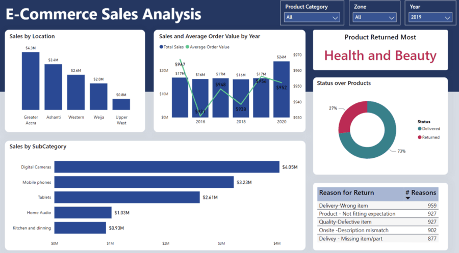

Trong project này, mình sẽ thiết kế và triển khai một Data Warehouse toàn diện để quản lý thông tin về các trường hợp tai nạn ô tô tại tất cả 49 tiểu bang của Hoa Kỳ. Kiến trúc kho dữ liệu sẽ được xây dựng trên cơ sở Star Schema và Snowflake, nhằm hỗ trợ tối ưu cho các hoạt động phân tích dữ liệu, tạo báo cáo và phục vụ các mục đích khai thác dữ liệu khác trong tương lai.

Mã nguồn dự án được công khai trên GitHub tại: **[GitHub Repository](https://github.com/longNguyen010203/DATA-WAREHOUSE-ACCIDENT-US-2016-2023)**

  

  Demo report

## 1. Project Overview
### 1.1 Objective

Trong bối cảnh hiện nay, khi vấn đề an toàn giao thông và ứng phó với các tình huống khẩn cấp ngày càng trở thành mối quan tâm toàn cầu, việc xây dựng một hệ thống quản lý dữ liệu toàn diện về tai nạn giao thông đóng vai trò vô cùng quan trọng. Hoa Kỳ, với mạng lưới giao thông rộng lớn và phức tạp, đối mặt với thách thức lớn trong việc thu thập, phân tích và sử dụng hiệu quả dữ liệu từ các vụ tai nạn xảy ra trên khắp 49 tiểu bang.

Dự án này ra đời nhằm xây dựng một kho dữ liệu tập trung, cung cấp thông tin chính xác, đầy đủ và kịp thời về tất cả các vụ tai nạn xảy ra tại các bang này. Kho dữ liệu sẽ không chỉ hỗ trợ các cơ quan quản lý trong việc đưa ra chính sách an toàn giao thông mà còn giúp cộng đồng nghiên cứu, lập kế hoạch ứng phó và giảm thiểu các rủi ro trong tương lai.

### 1.2 Importance

Dữ liệu tai nạn chính xác và tập trung hỗ trợ các sáng kiến ​​an toàn công cộng, hệ thống quản lý giao thông và nỗ lực hoạch định chính sách bằng cách cung cấp những hiểu biết sâu sắc có thể hành động về các mô hình tai nạn.

## 2. System Architecture
### 2.1 Pipeline Design

1. Sử dụng `Docker` để tạo môi trường và đóng gói ứng dụng. 
2. Sử dụng `Airflow` để điều phối công việc, lên lịch và tích hợp với các công cụ khác.
3. Dữ liệu `Accidents` và `Vehicles` được download từ `kaggle` dưới dạng `.csv` file.
4. Ta ingest dữ liệu vào datalake `MinIO` tại `bronze layer` bằng `Airflow` và `Python`.
5. Sử dụng `Spark` để đọc dữ liệu từ `MinIO` thông qua `FastAPI` để thực hiện xử lý dữ liệu, 
6. sau khi xử lý dữ liệu xong ta ghi lại vào `MinIO` tại `silver layer`.
7. Load dữ liệu đã được xử lý vào `Snowflake` tại `Staging` schema.
8. Sử dụng `dbt` để `transform`, tạo ra các bảng `dim` và `fact` tại analytics schema.
9. kho dữ liệu `Snowflake` sử dụng mô hình `Star` để triển khai và xây dụng.
10. Tạo báo cáo và phân tích với `Power BI`.

### 2.2 Star Schema

1. `Dim_County`: Chứa thông tin về quận/huyện.
2. `Dim_Street`: Lưu thông tin chi tiết về đường phố.
3. `Dim_City`: Chứa thông tin về thành phố. 
4. `Dim_State`: Chứa thông tin về bang.
5. `Dim_Vehicle`: Chứa thông tin chi tiết về phương tiện liên quan đến các vụ tai nạn.
6. `Dim_Location`: Chứa thông tin chi tiết về vị trí địa lý.
7. `Dim_Vehicle_Accident_Details`: Chứa thông tin chi tiết liên quan đến hành động của phương tiện trong các vụ tai nạn.
8. `Dim_Severity`: Mô tả mức độ nghiêm trọng của tai nạn.
9. `Dim_Time`: Chứa thông tin chi tiết về thời gian.
10. `Fact_Accidents`:
11. `Dim_Astronomical_Periods`: Lưu thông tin về các khoảng thời gian thiên văn trong ngày.
12. `Dim_Weather_Condition`: Chứa thông tin về loại thời tiết.
13. `Dim_POI (Point of Interest)`: Mô tả chi tiết về các yếu tố địa lý hoặc tiện ích gần khu vực tai nạn.
14. `Dim_Driver`: Chứa thông tin về tài xế liên quan đến các vụ tai nạn.
15. `Dim_Weather`: Chứa thông tin thời tiết tại thời điểm tai nạn.

### 2.3 ETL Pipeline

<!--  -->

## 3. Technologies Used

| Công nghệ             | Tác dụng |
|:-------------------- |:---------:|
| Python               | de      |
| Docker               | de      |
| Apache Spark               | de      |
| Apache Airflow               | de      |
| Snowflake               | de      |
| Power BI             | de      |
| FastAPI               | de      |
| Kaggle               | de      |
| MinIO               | de      |
| Dbt               | de      |