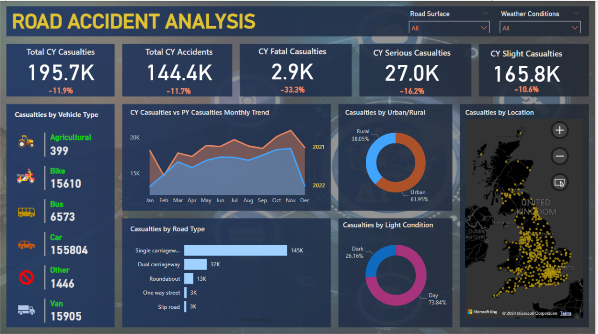
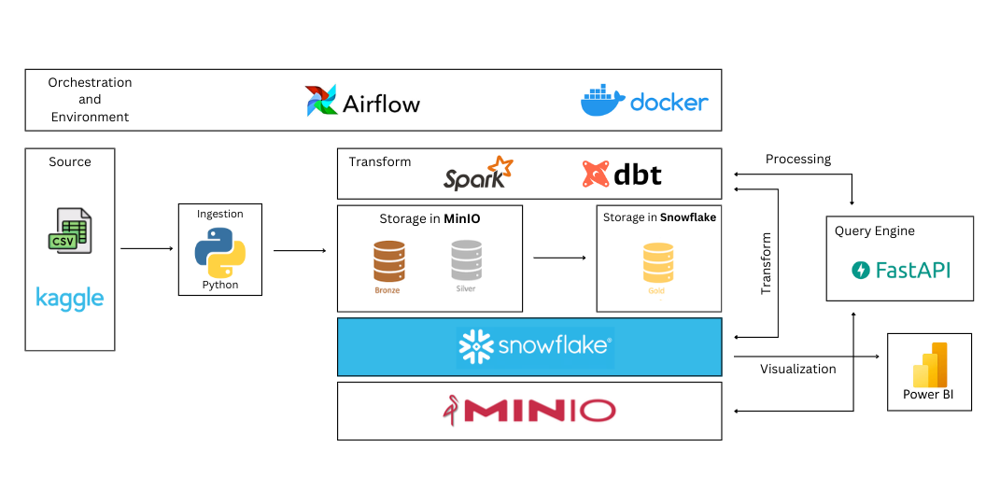
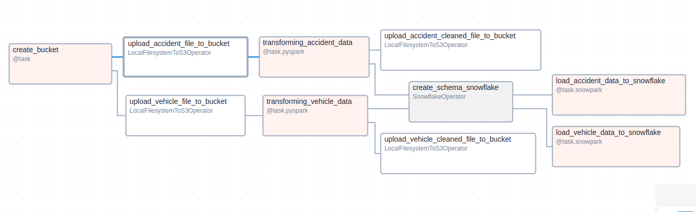
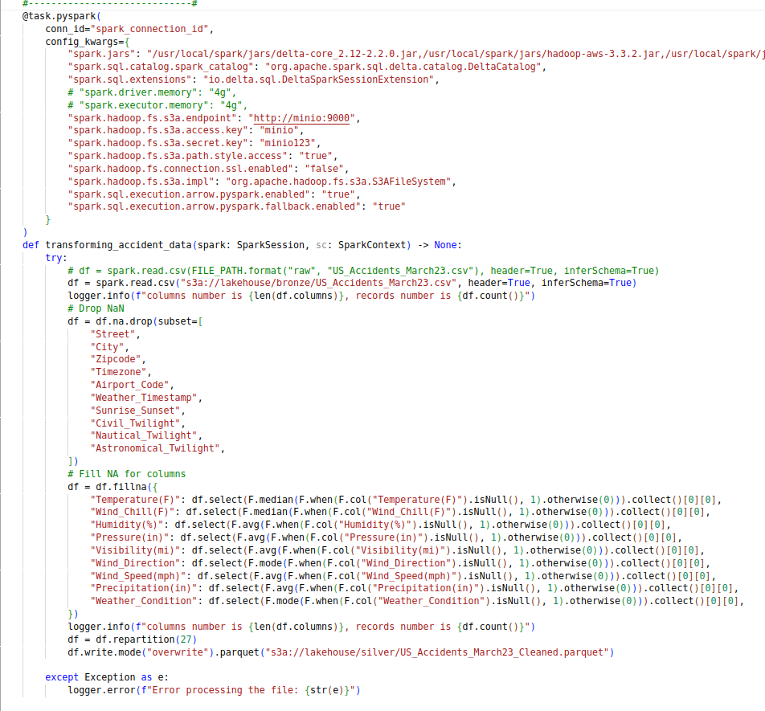
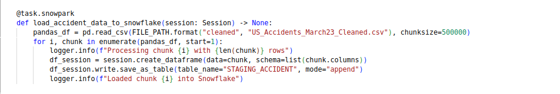
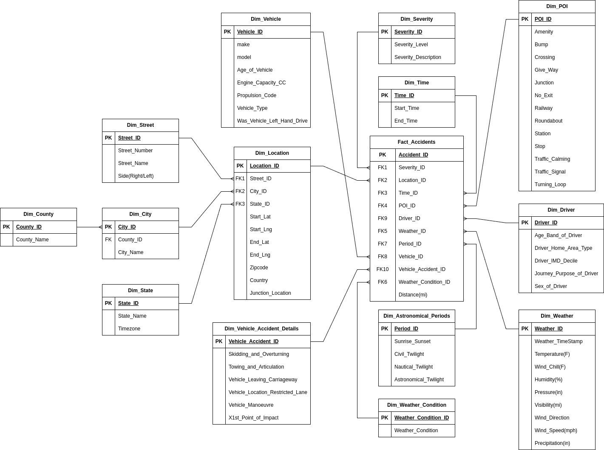
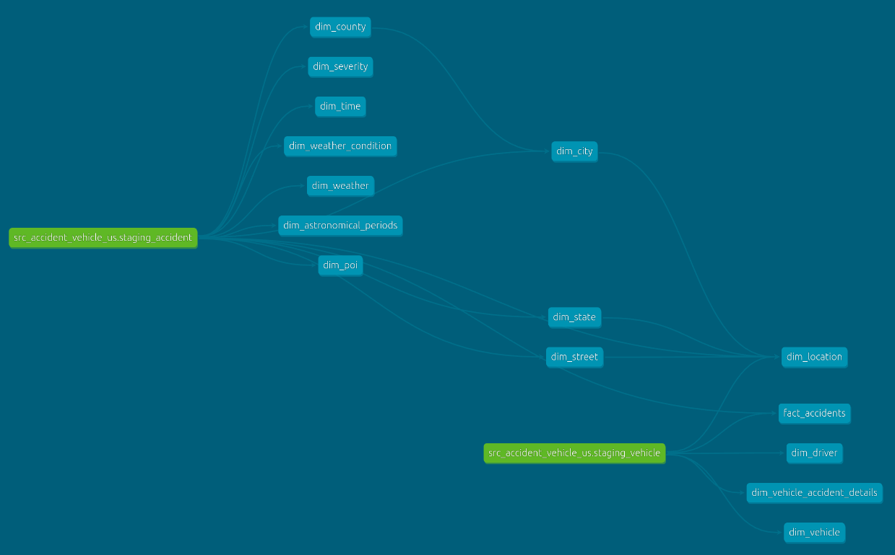
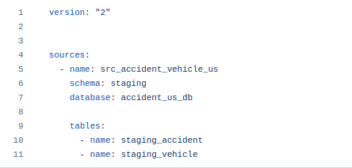
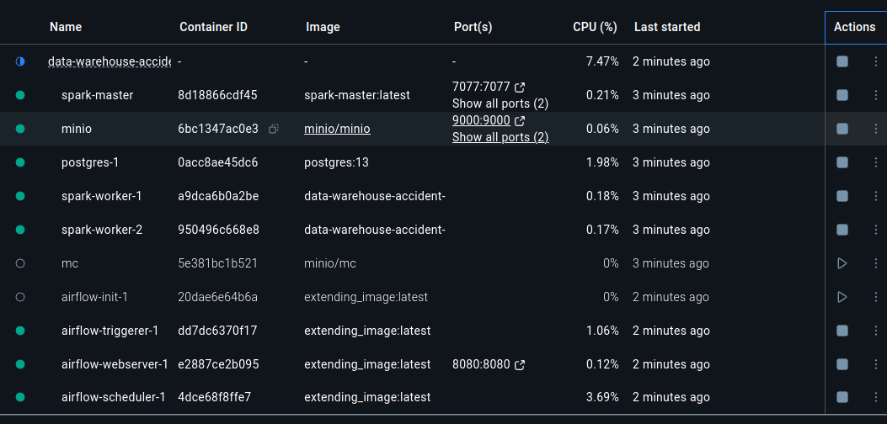

Trong project này, mình sẽ thiết kế và triển khai một Data Warehouse toàn diện để quản lý thông tin về các trường hợp tai nạn ô tô tại tất cả 49 tiểu bang của Hoa Kỳ. Kiến trúc kho dữ liệu sẽ được xây dựng trên cơ sở Star Schema và Snowflake, nhằm hỗ trợ tối ưu cho các hoạt động phân tích dữ liệu, tạo báo cáo và phục vụ các mục đích khai thác dữ liệu khác trong tương lai.

Mã nguồn dự án được công khai trên GitHub tại: **[GitHub Repository](https://github.com/longNguyen010203/DATA-WAREHOUSE-ACCIDENT-US-2016-2023)**
<div style="margin-top: 30px;"></div>

<div style="display: flex; align-items: center; background-color: #ff4d4d; padding: 10px 15px; border-radius: 5px; color: white; font-family: Arial, sans-serif;">
  <div style="width: 12px; height: 12px; background-color: #001f3f; border-radius: 50%; margin-right: 10px;"></div>
  <span style="font-weight: bold;">Demo report</span>
</div>

<div style="margin-top: 20px;"></div>



<div style="margin-top: 30px;"></div>

## 1. Project Overview
### 1.1. Objective

Trong bối cảnh hiện nay, khi vấn đề an toàn giao thông và ứng phó với các tình huống khẩn cấp ngày càng trở thành mối quan tâm toàn cầu, việc xây dựng một hệ thống quản lý dữ liệu toàn diện về tai nạn giao thông đóng vai trò vô cùng quan trọng. Hoa Kỳ, với mạng lưới giao thông rộng lớn và phức tạp, đối mặt với thách thức lớn trong việc thu thập, phân tích và sử dụng hiệu quả dữ liệu từ các vụ tai nạn xảy ra trên khắp 49 tiểu bang.

Dự án này ra đời nhằm xây dựng một kho dữ liệu tập trung, cung cấp thông tin chính xác, đầy đủ và kịp thời về tất cả các vụ tai nạn xảy ra tại các bang này. Kho dữ liệu sẽ không chỉ hỗ trợ các cơ quan quản lý trong việc đưa ra chính sách an toàn giao thông mà còn giúp cộng đồng nghiên cứu, lập kế hoạch ứng phó và giảm thiểu các rủi ro trong tương lai.

### 1.2. Importance

Dữ liệu tai nạn chính xác và tập trung hỗ trợ các sáng kiến ​​an toàn công cộng, hệ thống quản lý giao thông và nỗ lực hoạch định chính sách bằng cách cung cấp những hiểu biết sâu sắc có thể hành động về các mô hình tai nạn.

## 2. Data Description

Dataset **[US Accidents (2016 - 2023)](https://www.kaggle.com/datasets/sobhanmoosavi/us-accidents/data)** được lấy từ **[Kaggle](https://www.kaggle.com/)** với: hơn `7.700.000` records và `46` columns.

Dữ liệu tai nạn được thu thập từ tháng 2 năm 2016 đến tháng 3 năm 2023, sử dụng nhiều API cung cấp dữ liệu sự cố (hoặc sự kiện) giao thông trực tuyến. Các API này phát dữ liệu giao thông do nhiều thực thể khác nhau thu thập, bao gồm các sở giao thông của Hoa Kỳ và tiểu bang, các cơ quan thực thi pháp luật, camera giao thông và cảm biến giao thông trong mạng lưới đường bộ.

Dữ liệu bao gồm các biến về:

 - **Quận/huyện**: County,...
 - **Bang**: State,...
 - **Đường phố**: Street,...
 - **Thành phố**: City,...
 - **Vị trí**: Start_Lat, End_Lat, Country, Junction_Location,...
 - **Thời tiết**: Temperature(F), Wind_Chill(F), Visibility(ml), Humidity(%),...
 - **Phương tiện**: Model, Age_of_Vehicle, Engine_Capacity_CC,...
 - **Tài xế**: Age_Band_of_Driver, Sex_of_Driver, Driver_Home_Area_Type,...
 - **Độ nghiêm trọng**: Severity_Level,...
 - **Thời gian**: Start_Time, End_Time, Timezone,...
 - **Địa lý/Tiện ích**: Amenity, Bump, Crossing, Give_Way,...
 - **Yếu tố thiên văn**: Civil_Twilight, Nautical_Twilight, Astronomical_Twilight,...

## 3. System Architecture



1. Sử dụng `Docker` để tạo môi trường và đóng gói ứng dụng. 
2. Sử dụng `Airflow` để điều phối công việc, lên lịch và tích hợp với các công cụ khác.
3. Dữ liệu `Accidents` và `Vehicles` được download từ `kaggle` dưới dạng `.csv` file.
4. Dữ liệu được ingest vào datalake `MinIO` tại `bronze layer` bằng `Airflow` và `Python`.
5. Sử dụng `Spark` để đọc dữ liệu từ `MinIO` thông qua `FastAPI` để thực hiện xử lý dữ liệu, 
6. sau khi xử lý dữ liệu xong ta ghi lại vào `MinIO` tại `silver layer`.
7. Load dữ liệu đã được xử lý vào `Snowflake` tại `Staging` schema.
8. Sử dụng `dbt` để `transform`, tạo ra các bảng `dim` và `fact` tại analytics schema.
9. kho dữ liệu `Snowflake` sử dụng mô hình `Star` để triển khai và xây dụng.
10. Tạo báo cáo và phân tích với `Power BI`.

## 4. ETL Process Description



Đầu tiên Ta download sẵn hai tập dữ liệu từ Kaggle bao gồm: **[US_Accidents_March23.csv](https://www.kaggle.com/datasets/sobhanmoosavi/us-accidents/data?select=US_Accidents_March23.csv)** và **[Vehicle_Information.csv](https://www.kaggle.com/datasets/tsiaras/uk-road-safety-accidents-and-vehicles?select=Vehicle_Information.csv)** về LocalFileSystem dưới dạng file `.csv`. Tiếp theo ta tạo bucket `lakehouse` cho MinIO. Sau đó mount 2 dataset trên vào docker container, sử dụng Airflow tích hợp với S3 (`LocalFilesystemToS3Operator`) để upload file dữ liệu vào `bronze layer` của bucket (bronze layer thường chứa các dữ liệu dạng raw, chưa qua xử lý và làm sạch). Thực hiện ETL để Extract - Transform - Load dữ liệu đến hệ thống mục tiêu:

<div style="margin-top: 30px;"></div>


### 4.1. Extract: 
Tích hợp `Airflow` với `Spark` và cấu hình nó trong `pyspark decorator` để giúp spark tương tác với MinIO trong các quy trình đọc/ghi dữ liệu. Đọc các file dữ liệu từ data source (`bronze layer`) trong MinIO thông qua đường dẫn `s3a://lakehouse/bronze/File_Name.csv`.

### 4.2. Transform: 
Thực hiện transform dữ liệu với `pyspark`. Đối với dataset:
 - US_Accidents_March23.csv: 
   - Xóa các giá trị khuyết thiếu của cột Street, City, Zipcode, Timezone, Airport_Code,...
   - Điền giá trị khuyết thiếu cho các cột về thời tiết Temperature(F), Wind_Chill(F), Visibility(ml), Humidity(%), Precipitation(in),...
   - Xóa các giá trị trùng lặp của dataset.
 - Vehicle_Information.csv:
  
   - rename cột `Engine_Capacity_.CC.` thành `Engine_Capacity_CC`,...
   - Điền giá trị khuyết thiếu cho cột model,...
   - Xóa các giá trị trùng lặp của dataset.


Xem chi tiết về quá trình xử lý và làm sạch dữ liệu tại **[GitHub Repository](https://github.com/longNguyen010203/DATA-WAREHOUSE-ACCIDENT-US-2016-2023)**


Sau khi xử lý và làm sạch dữ liệu, ta thực hiên repartition cho dataframe với một số lượng nhất định để giảm tải cho bộ nhớ sau đó ghi dữ liệu vào silver layer của MinIO thông qua đường dẫn `s3a://lakehouse/silver/File_Name.parquet`, sử dụng định dạng parquet để tối ưu hóa khả năng compress và storage dữ liệu.

### 4.3. Load: 
Tạo Staging schema trong kho dữ liệu Snowflake.
  


Tích hợp `Airflow` với `Snowflake` để load dữ liệu đã được làm sạch từ `silver layer` trong MinIO tới `Staging` schema trong kho dữ liệu `Snowflake` với chunksize là 500.000 records (điều này giúp bộ nhớ không bị quá tải).

## 5. Star Schema Design



### 5.1 Fact Table

Chứa các thông tin dữ liệu thực tế của các vụ tai nạn

1. `Fact_Accidents`: thông tin các khóa ngoại (Foreign Keys) và thông tin về số người bị tử vong, bị thương

### 5.2. Dimension Tables

Chứa các thông tin mô tả để bổ sung ngữ cảnh cho fact table.

2. `Dim_County`: thông tin về quận/huyện.
3. `Dim_Street`: thông tin chi tiết về đường phố.
4. `Dim_City`: thông tin về thành phố. 
5. `Dim_State`: thông tin về bang.
6. `Dim_Vehicle`: thông tin chi tiết về phương tiện liên quan đến các vụ tai nạn.
7. `Dim_Location`: thông tin chi tiết về vị trí địa lý.
8. `Dim_Vehicle_Accident_Details`: thông tin chi tiết liên quan đến hành động của phương tiện trong các vụ tai nạn.
9. `Dim_Severity`: Mô tả mức độ nghiêm trọng của tai nạn.
10.  `Dim_Time`: thông tin chi tiết về thời gian.
11. `Dim_Astronomical_Periods`: thông tin về các khoảng thời gian thiên văn trong ngày.
12. `Dim_Weather_Condition`: thông tin về loại thời tiết.
13. `Dim_POI (Point of Interest)`: Mô tả chi tiết về các yếu tố địa lý hoặc tiện ích gần khu vực tai nạn.
14. `Dim_Driver`: thông tin về tài xế liên quan đến các vụ tai nạn.
15. `Dim_Weather`: thông tin thời tiết tại thời điểm tai nạn.

## 6. dbt - Transform Process Description



Trong phần này, chúng ta tập trung vào quy trình biến đổi dữ liệu (Transform) bằng cách sử dụng `dbt (Data Build Tool)`, một công cụ phổ biến cho việc xây dựng và quản lý quy trình xử lý dữ liệu.

Ta thực hiện Transform với dbt trên nền Snowflake để tạo ra các `Dimension` tables và `Fact` table.

### 6.1. Sources

<!--  -->
```yaml
version: "2"


sources:
  - name: src_accident_vehicle_us
    schema: staging
    database: accident_us_db

    tables: 
      - name: staging_accident
      - name: staging_vehicle
```

- Dữ liệu từ silver layer được load vào `Staging` schema của `Snowflake`, với các bảng được xử lý và làm sạch sau:
  
  - `src_accident_vehicle_us.staging_accident`: Chứa thông tin các vụ tai nạn giao thông.
  - `src_accident_vehicle_us.staging_vehicle`: Mô tả loại phương tiện liên quan đến tai nạn.

### 6.2. dbt Models

```sql
with source as (

    select
        -- uuid_string() as Driver_Id
        "Age_Band_of_Driver" as Age_Band_of_Driver
        , "Driver_Home_Area_Type" as Driver_Home_Area_Type
        , "Driver_IMD_Decile" as Driver_IMD_Decile
        , "Journey_Purpose_of_Driver" as Journey_Purpose_of_Driver
        , "Sex_of_Driver" as Sex_of_Driver

    from {{ source('src_accident_vehicle_us', 'staging_vehicle') }}

),

renamed as (

    select
        {{ dbt_utils.generate_surrogate_key([
            'Age_Band_of_Driver',
            'Driver_Home_Area_Type',
            'Driver_IMD_Decile',
            'Journey_Purpose_of_Driver',
            'Sex_of_Driver'
        ]) }} as Driver_Key
        
        , Age_Band_of_Driver
        , Driver_Home_Area_Type
        , Driver_IMD_Decile
        , Journey_Purpose_of_Driver
        , Sex_of_Driver

    from source

)

select * from renamed
```

- Áp dụng logic nghiệp vụ để xây dựng các bảng `Fact` và `Dimension`, phục vụ phân tích và báo cáo về các vụ tai nạn giao thông. Thực hiện tạo các `models` sau theo shema được định nghĩa ở trên:

  - `fact_accidents.sql` 
  - `dim_county.sql` 
  - `dim_street.sql` 
  - `dim_city.sql` 
  - `dim_state.sql` 
  - `dim_vehicle.sql` 
  - `dim_location.sql` 
  - `dim_vehicle_accident_details.sql` 
  - `dim_severity.sql` 
  - `dim_time.sql` 
  - `dim_astronomical_periods.sql` 
  - `dim_weather_condition.sql` 
  - `dim_poi.sql` 
  - `dim_driver.sql` 
  - `dim_weather.sql` 

- Với mỗi models ta sử dụng macro `generate_surrogate_key` của package `dbt_utils` để tạo primary key cho models đó.
- Để chạy models và khởi tạo các bảng dim, fact ta chạy lệnh: `dbt run --select fact_* dim_*`
- Để chạy và kiểm tra dữ liệu cho các models ta chạy lệnh: `dbt test`

### 6.3. Testing

```yaml
version: 2

models:
  - name: dim_astronomical_periods
    description: ""
    columns:
      - name: astronomical_periods_key
        data_type: varchar
        description: ""
        tests:
          - not_null
          - unique
      - name: sunrise_sunset
        data_type: varchar
        description: ""
        tests:
          - accepted_values:
              values: ['Night', 'Day']
      - name: civil_twilight
        data_type: varchar
        description: ""
        tests:
          - accepted_values:
              values: ['Night', 'Day']
      - name: nautical_twilight
        data_type: varchar
        description: ""
        tests:
          - accepted_values:
              values: ['Night', 'Day']
      - name: astronomical_twilight
        data_type: varchar
        description: ""
        tests:
          - accepted_values:
              values: ['Night', 'Day']
```

Ta Viết các `tests` kiểm tra dữ liệu đối với từng cột của từng `models`:

- Đối với cột `astronomical_periods_key` của models `dim_astronomical_periods`, cột này là primary key nên nó cần đảm bảo 2 yếu tố cơ bản đó là không được khuyết thiếu (`not null`) và nó phải là riêng biệt (`unique`).
- Đối với cột `sunrise_sunset` của models `dim_astronomical_periods` thì nó chỉ được nhận các giá trị là `Night`, `Day`.
- ...


Xem chi tiết các tests cho dữ liệu tại **[GitHub Repository](https://github.com/longNguyen010203/DATA-WAREHOUSE-ACCIDENT-US-2016-2023)**


## 7. Infrastructure



Để setup môi trường và cơ sở hạ tầng, ta sử dụng `docker` để khởi tạo các containers bao gồm:

- **MinIO**: Được sử dụng làm `datalake`, chứa dữ liệu được xử lý theo từng cấp độ.
  
  - `minio` container: đối tượng lưu trữ tương tự như `Amazon S3`.

    - 9000:9000
    - 9001:9001
  - `mc` container: công cụ CLI để quản lý và tương tác với MinIO server
- **Airflow**: được sử dụng để tích hợp với các cộng như `pyspark`, `snowflake`, `s3` để thực hiện các task ETL và lên lịch.

  - `postgres-1` container: lưu trữ metadata cho Airfow
  - `airflow-init-1` container: khởi tạo (initialize) cơ sở dữ liệu và cấu hình cho Airflow. Sau khi hoàn tất, nó sẽ dừng lại.
  - `airflow-trigger-1` container: dùng để xử lý các trigger DAG event-based (dựa trên sự kiện).
  - `airflow-webserver-1` container: cung cấp giao diện người dùng để quản lý và theo dõi các `DAG` trong Airflow.

    - 8080:8080
  - `airflow-scheduler-1` container: quản lý lịch trình thực thi các DAG. Nó thường đọc DAG từ cơ sở dữ liệu và kích hoạt các task dựa trên lịch trình.
- **Spark**: `Spark` được cấu hình ở chế độ `standalone` với 2 `worker` node, nhiệm vụ xử lý và làm sạch lượng dữ liệu lớn của project

  - `spark-master` container: node điều phối chính trong cluster Apache Spark. Nó quản lý tài nguyên và phân phối các task tới các worker node.

    - 7077:7077
    - 8081:8081
  - `spark-worker` container: chịu trách nhiệm thực thi các task được phân phối bởi Spark Master.

## 8. Technical Details

| Công nghệ      | Nhiệm vụ                           |
|:---------------|:----------------------------------:|
| Python, SQL    | Lập trình và truy vấn dữ liệu      |
| Apache Spark   | Xử lý dữ liệu lớn                  |
| Apache Airflow | Điều phối và lên lịch ETL          |
| Snowflake      | Data Warehouse                     |
| FastAPI        | Đọc và ghi dữ liệu                 |
| Kaggle         | Nguồn dữ liệu                      |
| MinIO          | Datalake                           |
| Dbt            | Transform Data                     |
| Docker         | Tạo môi trường và đóng gói         |
| Power BI       | Phân tích và tạo báo cáo trực quan |

## 9. Challenges

1. **Tốc độ**: Do Spark được cấu hình ở chế độ standalone nên không đạt hiệu suất cao, đôi khi bị crash giữa chừng khi thực hiện các task shuffle/read/write
2. **Môi trường phát triển**: Hiện tại mới có develop, tương lai sẽ xem xét môi trường testing, staging, production
3. **Deployment**: Sử dụng một trong các dịnh vụ điện toán đám mây: AWS, Azure, GCP