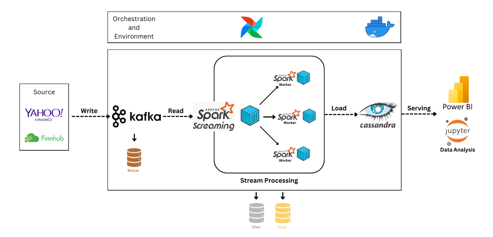
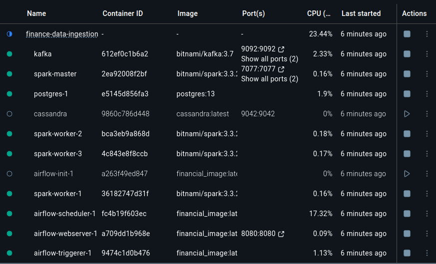
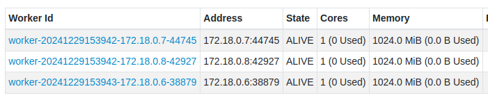
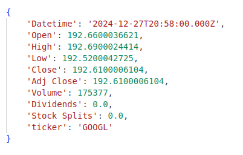
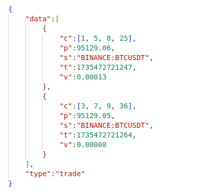
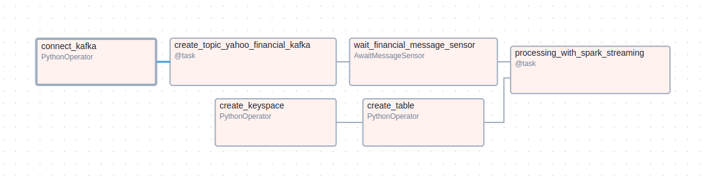
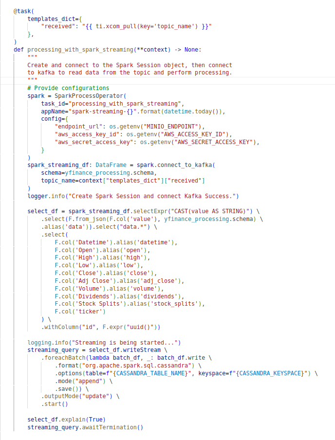

Trong project này, mình đã triển khai một hệ thống thu thập dữ liệu thời gian thực tích hợp Apache Kafka và Spark Streaming để xử lý dữ liệu tài chính từ Yahoo Finance và Finnhub, lưu trữ chúng trong Cassandra. Phục vụ phân tích dữ liệu chứng khoán, bao gồm giá cổ phiếu, khối lượng giao dịch và các chỉ số tài chính quan trọng. Dữ liệu thu thập được được phân tích chuyên sâu và trình bày dưới dạng báo cáo trực quan trên Power BI, hỗ trợ đưa ra quyết định đầu tư hiệu quả.

Mã nguồn dự án được công khai trên GitHub tại: **[GitHub Repository](https://github.com/longNguyen010203/Finance-Data-Ingestion-Pipeline-with-Kafka)**

  <!-- 

 -->
  📊 Demo Report

## 1. Project Overview
### 1.1. Objective

Trong bối cảnh thị trường tài chính toàn cầu ngày càng phức tạp và biến động, việc tiếp cận dữ liệu thời gian thực là yếu tố then chốt để các nhà đầu tư và tổ chức tài chính đưa ra quyết định nhanh chóng và chính xác. Dự án này được xây dựng nhằm mục tiêu phát triển một hệ thống thu thập và phân tích dữ liệu tài chính thời gian thực, tập trung vào việc xử lý và quản lý thông tin từ các nguồn đáng tin cậy như Yahoo Finance và Finnhub.

Dự án hướng đến việc xây dựng một hệ thống thu thập dữ liệu tài chính thời gian thực từ Yahoo Finance và Finnhub, sử dụng Apache Kafka và Spark Streaming để xử lý nhanh chóng và lưu trữ trong Cassandra. Hệ thống không chỉ phân tích dữ liệu chứng khoán như giá cổ phiếu, khối lượng giao dịch, và các chỉ số tài chính mà còn trình bày thông tin dưới dạng báo cáo trực quan bằng Power BI. Đồng thời, dự án được thiết kế linh hoạt, có khả năng mở rộng để đáp ứng nhu cầu ngày càng tăng của người dùng trong lĩnh vực tài chính.

### 1.2. Importance

Dự án này cung cấp một hệ thống thu thập và xử lý dữ liệu tài chính thời gian thực, giúp các nhà đầu tư và tổ chức tài chính có được thông tin kịp thời và chính xác. Với khả năng phân tích chuyên sâu và trực quan hóa bằng Power BI, dự án hỗ trợ đưa ra các quyết định đầu tư chiến lược, đồng thời thúc đẩy việc ứng dụng công nghệ hiện đại trong lĩnh vực tài chính, tạo ra lợi thế cạnh tranh trong thị trường.

## 2. Data Description

Với mục tiêu phân tích dữ liệu, tìm ra xu hướng thị trường chứng khoán và hỗ trợ đưa ra quyết định đầu tư hiệu quả. Mình đã lựa chọn hai nguồn dữ liệu là **[Yahoo Finance](https://finance.yahoo.com/)** và **[Finnhub](https://finnhub.io/)**. Nó đảm bảo được yếu tố dữ liệu đa dạng, từ giá cổ phiếu thời gian thực, lịch sử giao dịch đến các chỉ số tài chính.

1. Đối với `Yahoo Finance` mình tập chung thu thập dữ liệu về `lịch sử giá cổ phiếu` bao gồm:
- **Datetime**: Thời gian mà dữ liệu được ghi nhận.
- **Open**: Giá mở cửa của tài sản trong khoảng thời gian cụ thể (thường là đầu ngày giao dịch).
- **High**: Giá cao nhất mà tài sản đạt được trong khoảng thời gian cụ thể.
- **Low**: Giá thấp nhất mà tài sản đạt được trong khoảng thời gian cụ thể.
- **Close**: Giá đóng cửa của tài sản trong khoảng thời gian cụ thể (thường là cuối ngày giao dịch).
- **Adj_Close**: Giá đóng cửa đã được điều chỉnh để phản ánh tác động của các sự kiện như chia cổ tức hoặc chia tách cổ phiếu. Đây là dữ liệu chính xác hơn khi phân tích lịch sử giá.
- **Volume**: Khối lượng giao dịch, cho biết tổng số cổ phiếu (hoặc tài sản) được giao dịch trong khoảng thời gian cụ thể.
- **Dividends**: Cổ tức được chi trả trên mỗi cổ phiếu trong khoảng thời gian cụ thể. Nếu không có cổ tức, giá trị sẽ là 0.
- **Stock_Splits**: Thông tin về việc chia tách cổ phiếu. Ví dụ: nếu giá trị là 2, điều đó có nghĩa cổ phiếu đã được chia tách theo tỷ lệ 2:1.
- **Ticker**: Mã giao dịch của tài sản, thường là ký hiệu nhận dạng duy nhất cho một cổ phiếu trên thị trường. VD: "AAPL" cho Apple.
- ...
  
1. Đối với `Finnhub` mình sẽ tập chung thu thập dữ liệu về `Trades(Giao dịch)` bao gồm:
- **s(Symbol)**: Mã chứng khoán hoặc tài sản được giao dịch. VD: "AAPL" cho Apple,...
- **p(Last price)**: Giá cuối cùng của giao dịch gần nhất, thể hiện giá trị mà tài sản được mua/bán.
- **t(Time)**: Thời gian được biểu diễn ở dạng UNIX timestamp tính bằng mili-giây.
- **v(Volume)**: Số lượng cổ phiếu hoặc tài sản được giao dịch trong lần giao dịch cụ thể.
- **c(List of trade conditions)**:Danh sách các điều kiện giao dịch. Các điều kiện này có thể chỉ ra thêm thông tin về cách giao dịch được thực hiện
- ...

## 3. System Architecture

1. Sử dụng `Docker` để tạo môi trường và đóng gói ứng dụng.
2. Sử dụng `Airflow` để điều phối tasks, lên lịch và tích hợp với các công cụ khác.
3. Dữ liệu về các chỉ số tài chính được thu thập từ `Yahoo Finance API` và `Finnhub API` thông qua các thư viện Python: `yfinance` và `websocket`.
4. Dữ liệu sau khi thu thập được gửi vào `Topic` cụ thể trong `Kafka` và chia vào các `partition`.
5. Dữ liệu được ghi tuần tự và duy trì trong `Kafka cluster` dựa trên cấu hình `retention` (thời gian lưu trữ).
6. `Spark Streaming` truy cập `Topic`, đọc dữ liệu từ các `partition` theo `offset` và thực hiện xử lý theo thời gian thực.
7. Mỗi `Record` xử lý xong sẽ được đẩy thẳng vào `Cassandra`.
8. Dữ liệu sẽ được phân tích và tạo báo cáo với `Jupyter` và `Power BI`.

## 4. Setup Infrastructure

Để setup môi trường và cơ sở hạ tầng, ta sử dụng docker để khởi tạo các containers bao gồm:

- **Kafka**: Được setup với Kraft (Kafka Kraft), loại bỏ sự phụ thuộc vào ZooKeeper để quản lý metadata.
  
  - `kafka` container: đóng vai trò là trung tâm truyền tải dữ liệu (Message Broker)

    - 9092:9092
    - 9094:9094
- **Airflow**: được sử dụng để tích hợp với các công cụ như pyspark, kafka để thực hiện các task ETL và lên lịch.

  - `postgres-1` container: lưu trữ metadata cho Airfow
  - `airflow-init-1` container: khởi tạo (initialize) cơ sở dữ liệu và cấu hình cho Airflow. Sau khi hoàn tất, nó sẽ dừng lại.
  - `airflow-trigger-1` container: dùng để xử lý các trigger DAG event-based (dựa trên sự kiện).
  - `airflow-webserver-1` container: cung cấp giao diện người dùng để quản lý và theo dõi các `DAG` trong Airflow.

    - 8080:8080
  - `airflow-scheduler-1` container: quản lý lịch trình thực thi các DAG. Nó thường đọc DAG từ cơ sở dữ liệu và kích hoạt các task dựa trên lịch trình.
- **Spark**: Spark được cấu hình ở chế độ standalone với 3 worker node(mỗi worker node được chia 1 CPU và 1GB Ram), nhiệm vụ xử lý và làm sạch lượng dữ liệu lớn của project

  

  - `spark-master` container: node điều phối chính trong cluster Apache Spark. Nó quản lý tài nguyên và phân phối các task tới các worker node.

    - 7077:7077
    - 8081:8081
  - `spark-worker` container: chịu trách nhiệm thực thi các task được phân phối bởi Spark Master.
- **Cassandra**: đóng vai trò là cơ sở dữ liệu NoSQL phân tán, giúp lưu trữ lượng lớn dữ liệu thời gian thực.

  - `cassandra` container: Nhận và lưu trữ dữ liệu được xử lý từ spark streaming

## 5. Crawler Data Process Description
### 5.1. Yahoo Finance

Để Thu thập được dữ liệu về lịch sử giá cổ phiếu và các số liệu về tài chính từ Yahoo Finance, nền tảng này cho phép truy cập thông qua giao diện người dùng hoặc API không chính thức (thư viện `yfinance` trong Python) với một số công cụ và thư viện khác như: `pandas`, `time`.
 - Đầu tiên ta cần xác định các mã cổ phiếu(Ticker Symbols) cần lấy dữ liệu. VD: "AAPL", "MSFT", "GOOGL", "NVIDIA"...
 - Khi thu thập dữ liệu từ Yahoo Finance (thông qua thư viện yfinance), `period` và `interval` là hai tham số quan trọng để xác định phạm vi và tần suất của dữ liệu ta muốn lấy
  
   - `Period` là Khoảng thời gian lịch sử mà ta muốn lấy dữ liệu, nó nhận các đối số như: 1d, 5d, 1mo, 1y,...
   - `Interval` là Khoảng cách thời gian giữa hai điểm dữ liệu liên tiếp, nó nhận các đối số như: 1m, 2m, 5m, 15m, 1d,...
 - Để thu thập dữ liệu thời gian thực ta đặt:

   - `Period=1d` chỉ tập trung vào ngày giao dịch gần nhất, phù hợp để giám sát và phân tích thị trường theo thời gian thực.
   - `Interval=1m` nó cung cấp dữ liệu với độ chi tiết cao, cho phép phân tích xu hướng và biến động giá theo từng phút trong ngày.

 - Với mỗi `request`, API sẽ gửi tất cả dữ liệu cả mới và dữ liệu cũ trước đó ở dạng `pandas dataframe`, nên ta chỉ lấy bản ghi mới nhất, tức bản ghi cuối cùng với hàm `.tail(1)`
 - Với mỗi bản ghi dữ liệu thu thập được ta convert từ `pandas dataframe` sang `json` với hàm `.to_json()`. dạng json tương thích với Kafka và giúp nó dễ dàng làm việc.
    
 - Sau khi convert sang `json` ta thực hiện gửi bản ghi tới `topic` trong `Kafka` đã được tạo trước đó.
 - Trong quá trình thu thập ta sử dụng thư viện `time` với hàm `time.sleep` để :

   - Tuân thủ giới hạn tốc độ của API
   - Giảm tải hệ thống
   - Tránh bị block hoặc ban tài khoản
   - Giảm nguy cơ lỗi kết nối
   - Điều chỉnh thời gian thu thập dữ liệu phù hợp

### 5.2. Finnhub

Để thu thập được dữ liệu về giao dich(trades) từ Finnhub ta sử dụng thư viện `websocket`.
 - Đầu tiên ta cần `API Key`, để lấy API Key ta truy cập **[Finnhub](https://finnhub.io/)**.
 - Xác định các mã cổ phiếu(Ticker Symbols) cần lấy dữ liệu. Ta lấy các mã được chọn ở trên để dữ liệu được đồng nhất.
 - Ta khởi tạo WebSocket App với API Key đã lấy ở trên và thực hiện thu thập
 - Dữ liệu thu thập được có dạng:
  
    
 - Dữ liệu thu thập được tồn tại các bản ghi trùng lặp nên ta cần lọc các bản ghi trùng lặp bằng cấu trúc dữ liệu `set` trong python
 - sau khi có dữ liệu ta ghi từng bản ghi vào `topic` trong `Kafka` đã được tạo trước đó.

## 6. Stream Data Process Description

Đầu tiên ta cần kết nối đến Kafka container với các cấu hình sau:
 - `"bootstrap.servers": "kafka:9092"`: Địa chỉ của Kafka brokers.
 - `"group.id": "t5"`: Consumer group.
 - `"enable.auto.commit": False`: Tắt tính năng tự động commit offset.
 - `"auto.offset.reset": "earliest"`: Consumer sẽ đọc từ đầu (offset thấp nhất).
 - `"security.protocol": "PLAINTEXT"`: Giao thức bảo mật để giao tiếp với Kafka

các cấu hình này đã được định nghĩa bằng các biến môi trường khi khởi tạo kafka container trong docker compose.

Tiếp theo ta tạo `Topic`, trước khi tạo Topic ta cần kiểm tra xem topic đó đã được tạo trước đó hay chưa, nếu chưa ta tiến hành tạo topic với các cấu hình sau:
 - `partitions=1`: Số lượng partitions trong Kafka topic.
 - `replication factor=1`: Số lượng bản sao (replicas) của mỗi partition.
  
Các cấu hính được thiết lập một cách đơn giản nhất để phục vụ cho mục đích học tập.

Sau khi tạo xong topic ta push topic name vào `XCom` để các task phía sau có thể sử dụng nếu cần.

Tiếp đó ta thiết lập các thành phần cần thiết để Cassandra sẵn sàng nhận dữ liệu từ spark streaming nhưng trước tiên ta cần kết nối đến cassandra container với host cassandra và port 9042 đã được thiết lập bằng các biến môi trường khi khởi tạo với docker compose. các thành phần gồm:

 - `Create keyspace`: Tạo keyspace với các cấu hình sau:
   - `class: SimpleStrategy`: Sử dụng cho các cluster đơn giản, thường chỉ có một datacenter
   - `replication_factor: 1`: Dữ liệu sẽ được sao chép trên hai nodes. Recommend nên đặt lớn hơn 2 để tăng tính chịu lỗi.
 - `Create table`: Tạo bảng với các cột tương ứng với dữ liệu thu thập được.

Tiếp theo ta tạo một `sensor` để Lắng nghe tin nhắn từ Kafka bằng cách sử dụng `AwaitMessageSensor`. Sensor này kết nối đến một topic Kafka cụ thể và chờ cho đến khi một tin nhắn xuất hiện. Khi có tin nhắn mới, sensor sẽ kích hoạt và cho phép luồng công việc trong DAG tiếp tục.


Xem chi tiết code cho các phần trên tại **[GitHub Repository](https://github.com/longNguyen010203/Finance-Data-Ingestion-Pipeline-with-Kafka/blob/main/dags/ingestion_yfinance_data_to_cassandra_db.py)**


sau khi sensor nhận được tin nhắn thì `spark streaming` được khởi động để bắt đầu quá trình xử lý dữ liệu.

  

Đầu tiên nó kết nối đến spark container, ở đâu mình sử dụng `SparkProcessOperator` để thực hiện điều đó. Tiếp theo kết nối với `kafka` với `topic` và `schema` đã được tạo trước đó. Sau đó xử lý dữ liệu, do dữ liệu khi được gửi đến đã khá sạch, ta chỉ đổi lại tên sao cho đồng nhất với tên các cột của bảng đã được tạo bên trên. Với mỗi bản ghi đã được xử lý xong sẽ được load thẳng vào cassandra với mode `append`.

## 7. Technical Details

| Công nghệ      | Nhiệm vụ                           |
|:---------------|:----------------------------------:|
| Python, SQL    | Lập trình và truy vấn dữ liệu      |
| Apache Spark   | Xử lý dữ liệu lớn                  |
| Apache Airflow | Điều phối và lên lịch ETL          |
| Apache Kafka   | Trung tâm truyền tải dữ liệu (Message Broker)         |
| Apache Cassandra| Lưu trữ dữ liệu thời gian thực    |
| Docker         | Tạo môi trường và đóng gói         |
| Yfinance       | Nguồn dữ liệu của project         |
| Finnhub        | Nguồn dữ liệu của project         |
| Power BI       | Phân tích và tạo báo cáo trực quan |

## 8. Challenges

1. **Giới hạn API**: Việc truy cập dữ liệu có thể bị hạn chế về tần suất hoặc số lượng mã cổ phiếu.
2. **Dữ liệu thiếu sót**: Một số mã cổ phiếu có thể không cung cấp đủ thông tin, ví dụ như cổ tức hoặc chia tách.
3. **Thiếu sự đa dạng**: Yahoo Finance và Finnhub chỉ cho phép thu thập một số loại dữ liệu nhất định.