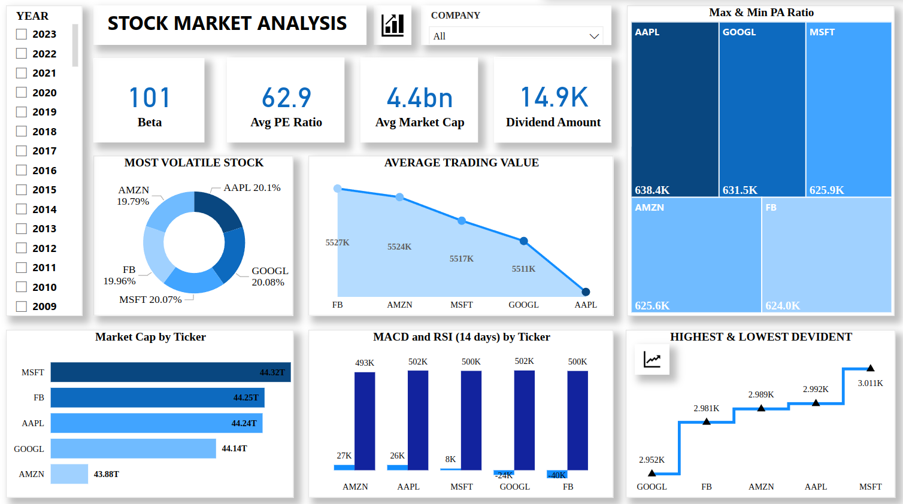
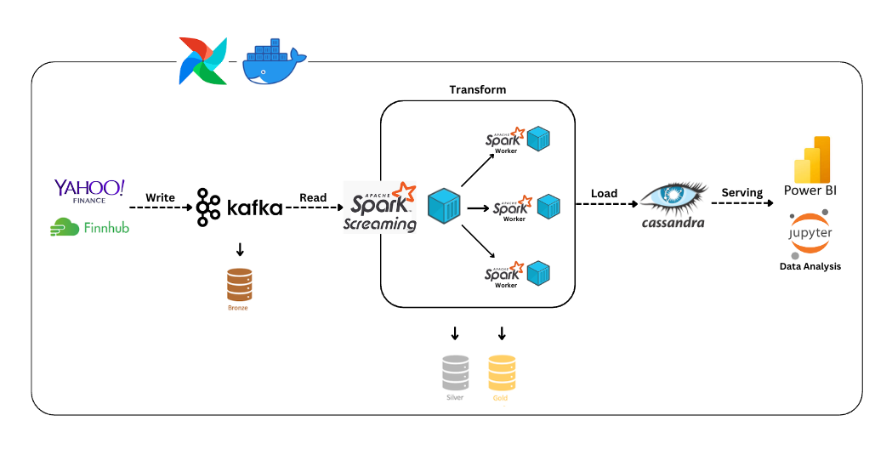

Trong project này, mình đã triển khai một hệ thống thu thập dữ liệu thời gian thực tích hợp Apache Kafka và Spark Streaming để xử lý dữ liệu tài chính từ Yahoo Finance và Finnhub, lưu trữ chúng trong Cassandra. Phục vụ phân tích dữ liệu chứng khoán, bao gồm giá cổ phiếu, khối lượng giao dịch và các chỉ số tài chính quan trọng. Dữ liệu thu thập được được phân tích chuyên sâu và trình bày dưới dạng báo cáo trực quan trên Power BI, hỗ trợ đưa ra quyết định đầu tư hiệu quả.

Mã nguồn dự án được công khai trên GitHub tại: **[GitHub Repository](https://github.com/longNguyen010203/Finance-Data-Ingestion-Pipeline-with-Kafka)**

  <!-- 

 -->
  📊 Demo report

## 1. Project Overview
### 1.1. Objective

Trong bối cảnh thị trường tài chính toàn cầu ngày càng phức tạp và biến động, việc tiếp cận dữ liệu thời gian thực là yếu tố then chốt để các nhà đầu tư và tổ chức tài chính đưa ra quyết định nhanh chóng và chính xác. Dự án này được xây dựng nhằm mục tiêu phát triển một hệ thống thu thập và phân tích dữ liệu tài chính thời gian thực, tập trung vào việc xử lý và quản lý thông tin từ các nguồn đáng tin cậy như Yahoo Finance và Finnhub.

Dự án hướng đến việc xây dựng một hệ thống thu thập dữ liệu tài chính thời gian thực từ Yahoo Finance và Finnhub, sử dụng Apache Kafka và Spark Streaming để xử lý nhanh chóng và lưu trữ trong Cassandra. Hệ thống không chỉ phân tích dữ liệu chứng khoán như giá cổ phiếu, khối lượng giao dịch, và các chỉ số tài chính mà còn trình bày thông tin dưới dạng báo cáo trực quan bằng Power BI. Đồng thời, dự án được thiết kế linh hoạt, có khả năng mở rộng để đáp ứng nhu cầu ngày càng tăng của người dùng trong lĩnh vực tài chính.

### 1.2. Importance

Dự án này cung cấp một hệ thống thu thập và xử lý dữ liệu tài chính thời gian thực, giúp các nhà đầu tư và tổ chức tài chính có được thông tin kịp thời và chính xác. Với khả năng phân tích chuyên sâu và trực quan hóa bằng Power BI, dự án hỗ trợ đưa ra các quyết định đầu tư chiến lược, đồng thời thúc đẩy việc ứng dụng công nghệ hiện đại trong lĩnh vực tài chính, tạo ra lợi thế cạnh tranh trong thị trường.

## 2. Data Description

## 3. System Architecture

1. Sử dụng `Docker` để tạo môi trường và đóng gói ứng dụng.
2. Sử dụng `Airflow` để điều phối tasks, lên lịch và tích hợp với các công cụ khác.
3. Dữ liệu về các chỉ số tài chính được thu thập từ `Yahoo Finance API` và `Finnhub API` thông qua các thư viện Python: `yfinance` và `websocket`.
4. Dữ liệu sau khi thu thập được gửi vào `Topic` cụ thể trong `Kafka` và chia vào các `partition`.
5. Dữ liệu được ghi tuần tự và duy trì trong `Kafka cluster` dựa trên cấu hình `retention` (thời gian lưu trữ).
6. `Spark Streaming` truy cập `Topic`, đọc dữ liệu từ các `partition` theo `offset` và thực hiện xử lý theo thời gian thực.
7. Mỗi `Record` xử lý xong sẽ được đẩy thẳng vào `Cassandra`.
8. Dữ liệu sẽ được phân tích và tạo báo cáo với `Jupyter` và `Power BI`.

## 4. Crawler Data Process Description

## 5. Stream Data Process Description

## 6. Infrastructure

## 7. Technical Details

## 8. Challenges