Find out how to create and organize your content quickly and intuitively in **FeelIt** theme.

<!--more-->

## 1. 🌍 Introduction

### 1.1. Amazon Lambda
**Amazon Lambda (AWS Lambda)** is a serverless computing service provided by Amazon Web Services (AWS). It enables users to run code without provisioning or managing servers. With AWS Lambda, you can execute your code in response to specific events, such as changes in data, HTTP requests, or system events, while only paying for the actual computing time used. Lambda automatically scales to handle the workload, making it ideal for applications with unpredictable or variable traffic. It supports a variety of programming languages, including Python, Node.js, Java, and more, making it flexible for different types of applications.

<div style="text-align: center;">
    
</div>

### 1.2. Amazon CloudWatch
**Amazon CloudWatch** is a monitoring and observability service provided by Amazon Web Services (AWS). It allows users to collect, monitor, and analyze metrics, logs, and event data from AWS resources, applications, and services in real-time. With CloudWatch, users can set up alarms to trigger notifications or automatic actions based on specified thresholds, helping to maintain the health and performance of applications. It also offers dashboards for visualizing metrics and logs, making it easier to track system health and troubleshoot issues. CloudWatch supports a wide range of AWS services, enhancing overall cloud infrastructure management and optimization.

<div style="text-align: center;">
    
</div>

### 1.3. Amazon Kinesis Data Streams
**Amazon Kinesis Data Streams** is a fully managed, serverless streaming data service provided by Amazon Web Services (AWS). It enables you to capture, process, and store real-time data streams at any scale. With Kinesis Data Streams, you can collect data from various sources such as application logs, clickstreams, and IoT devices, and process it within seconds to support real-time analytics and decision-making. The service offers automatic scaling to handle varying data volumes and integrates seamlessly with other AWS services, facilitating the development of comprehensive streaming data applications.

**Amazon Kinesis Data Streams** is a scalable and durable real-time data streaming service provided by AWS. It allows users to continuously capture, process, and store gigabytes of data per second from various sources such as application logs, social media feeds, IoT devices, and financial transactions. Kinesis Data Streams provides real-time data ingestion, enabling users to build custom applications that process or analyze the data in real-time. It offers flexibility with fine-tuned data retention and scaling options, and integrates with other AWS services like Lambda, S3, and Kinesis Data Analytics for advanced stream processing. This service is ideal for scenarios like real-time monitoring, log and event data processing, and analytics at scale.

<div style="text-align: center;">
    
</div>

### 1.4. Amazon Kinesis Data Firehose
**Amazon Kinesis Data Firehose** is a fully managed service under AWS Kinesis that makes it easy to load real-time streaming data into data lakes, data warehouses, and analytics services. It automatically captures, transforms, and delivers streaming data to destinations such as Amazon S3, Amazon Redshift, Amazon Elasticsearch Service, and third-party services like Splunk. Kinesis Firehose handles the scaling and delivery of the data streams without requiring users to manage any infrastructure. It also supports data transformation with AWS Lambda before delivery and allows for configurable buffering, making it an ideal solution for near real-time data ingestion and analysis.

<div style="text-align: center;">
    
</div>

## 2. 📊 Present the problem

## 3. 🔦 Architecture


- 📦 **Technology and Services**:
  - `S3`
  - `Lambda`
  - `Kinesis Data Streams`
  - `Kinesis Data Firehose`
  - `CloudFormation`
  - `CloudWatch`
  - `IAM`
- 🔎 **Data Flow**: Stock data will be randomly generated using `Python` code acting as `producer`, then sent to `Kinesis Data Streams`, Next will be moved to `Firehose data stream`. Here the data will be `transformed` using `Lambda`, and will finally be `stored` in `S3`. Activities at `Amazon Kinesis Data Firehose` will be `monitored` by `Amazon CloudWatch`.


## 4. 📑 Preparation

### 4.1. Source Code

See source code details here: [GitHub - Stream processing with Amazon Kinesis](https://github.com/longNguyen010203/Stream-Processing-with-Amazon-Kinesis)

Download the source code to your local machine with the following command:
```bash
git clone https://github.com/longNguyen010203/Stream-Processing-with-Amazon-Kinesis.git
```

- **model/StockTrade.py** - The file contains the `StockTrade` object definition class containing the following properties: `tickerSymbol`, `tradeType`, `price`, `quantity`, `id`. Methods: `toJsonAsBytes`, `fromJsonAsBytes`,...
- **model/KinesisStream.py** - The file contains the class that defines the `KinesisStream` object with the properties: `kinesis_client`, `streamName` and methods: `put_record`, `get_records`,... to manipulate `Amazon Kinesis` through the [SDK for Python (Boto3)](https://docs.aws.amazon.com/code-library/latest/ug/python_3_kinesis_code_examples.html).
- **writer/StockTradeGenerator.py** - The file contains the class that defines the `StockTradeGenerator` object, which is responsible for generating data from existing data. More specifically, creating stock transactions. It has a `getRandomTrade` method, which returns a `StockTrade` object, a stock trade.
- **writer/StockTradesWriter.py** - The file contains the class that defines the `StockTradesWriter` object, this class defines the `sendStockTrade` method, which is responsible for sending data to `kinesis data streams`, acting as a `producer`.
- **processor/StockTradeReader.py** - The file contains the class that defines the `StockTradeReader` object, which defines the `getStockTrade` method, which is responsible for reading data from `kinesis data streams`, acting as a `consumer`.
- **processor/StockStatistic** - The file contains the class that defines the `StockStatistics` object, this class is responsible for statistics on collected transactions with the following statistics: `Most Popular Stock Count`,...
- **lambda/StreamLambda.py** - The file contains data transformation logic.


### 4.2. Initialize python virtual environment
Before creating the `virtual environment`, you need to install `Python`. If your computer does not have it, please visit [python.org](https://www.python.org/) to install it.
Next you need to download the `source code` by following the instructions above.
Then in the `Terminal` window, move to the `root` directory of the source code, specifically the `stream-processing-with-amz-kinesis` directory.

<div style="text-align: center;">
    
</div>

To create a `python virtual environment`, run the following command:
```bash
python3 -m venv .ws2-venv
```

You can name the `virtual environment` any way you want.

<div style="text-align: center;">
    
</div>

Next to `activate` the `virtual environment`, run the following command:
```bash
source .ws2-venv/bin/activate
```

A sign that you have successfully activated the `virtual environment` is that the `virtual environment name` appears after the folder name.

<div style="text-align: center;">
    
</div>


### 4.3. Install libraries and dependencies
The `requirements.txt` file in the `source code` contains the `libraries` and `dependencies` required for this `workshop`.
To install we run the following command:
```bash
pip install -r requirements.txt
```
<div style="text-align: center;">
    
</div>

To check if `libraries and dependencies` are installed, run the following command:
```bash
pip list
```
<div style="text-align: center;">
    
</div>
<div style="text-align: center;">
    
</div>

If your `terminal` window appears as above, you have successfully installed.

## 5. 📡 Setup Infrastructure
### 5.1. Create and Testing Kinesis Data Streams
#### 5.1.1. Create Kinesis Data Streams
In the search bar, enter the keyword `"kinesis"` and click to select the `kinesis service`.


In the `Kinesis service console`, select `Create Data Stream`.


In the `Data stream name` field, fill in `StockTradeStream`

You can give it any name you want.



In the `Data stream capacity` section, we fill in `1` in the `Provisioned shards` field.


Finally, we choose `Create data stream` to create `kinesis data streams`.


In the `StockTradesWriter.py` and `StockTradeReader.py` files, we need to check the following parameters: `streamName`, `region_name`, `aws_access_key_id`, `aws_secret_access_key`. Board


You need to write down your correct `kinesis stream name`, write down the correct `region name` where you are using the service, and finally you need to fill in your `AccessKeys`, to make sure the stream works.

#### 5.1.2. Demo and Test Kinesis Data Streams
On your local machine, open two `terminal` windows, then navigate to the `root` directory (`stream-processing-with-amz-kinesis`) of the source code, then activate the `virtual environment` as instructed above. Then move the `Stock-Trade-Kinesis` folder to both windows with the following command:

```bash
cd Stock-Trade-Kinesis
```


The `first Terminal window` represents the `Producer` who is responsible for `sending data` to `Kinesis Data Streams`, the `second Terminal window` represents the `Consumer` who is responsible for `multiplying data` from `Kinesis Data Streams`. To launch, run the following commands on two `Terminal` window:

```bash
python3 -m writer.StockTradesWriter
python3 -m processor.StockTradeReader
```


Then we press `Enter` on each window.

<div style="max-width: 100%; text-align: center;">
    <video width="100%" controls>
        <source src="./producer_consumer_testing.webm" type="video/webm">
    </video>
</div>

We can see data being sent and received in `real time`, the `producer` `sends` immediately the `commsumer` `receives` it. That is the main effect of `Kinesis Data Streams`.

### 5.2. Create S3 Bucket
In the `S3 dashboard`, select `Create bucket`.


In the `Bucket name` field, fill in `stock-trade-stream`. then click `Create bucket`.


### 5.3. Create Lambda Function
In the `Lambda console`, select `Create a function`


In the `Function name` field, enter `stock-stream-processor`. Then we choose `Python3.12` for the `Runtime type` field.

You can name the function as you like.



We choose `x86_64` for the `Architecture` field. Finally, we click `Create function`.


After creating the `Lambda Function`. In the `Code source` section, paste the `transform logic code` into the code editor, then click `deploy` to save the changes.


In the `Configuration` tab, select `Edit`.


In the `timeout` section, change it to `3 min` then select `save`.


### 5.4. Create Kinesis Data Firehose
In the `Kinesis Data Firehose` console, select `Create Firehose Stream`.


In the `source` and `destination` sections, we select `Amazon Kinesis Data Streams` and `Amazon S3` respectively.


In the `Kinesis data stream` section, we select the `Kinesis data stream` created above.


In the `Firehose stream name` field, we fill in `KDS-S3-StockStream` and in the `Transform source records with AWS Lambda` field we select `turn on data transform`.


You can fill in the name as you like, it is optional.



Then in `AWS Lambda Function`, we select the `lambda function` created above.


Next in `Destination Settings`, we select the `S3 bucket` that was created earlier. Then turn on `New line delimiter`. Finally click `Create Firehose data stream`.


## 6. 👷 Run Stream Processing System
Once the infrastructure is ready to go, in the `terminal` window on your local machine run the following command:

```bash
python3 -m writer.StockTradesWriter
```
<div style="text-align: center;">
    
</div>

This command will launch the `producer` to start sending data to the `kinesis data streams` and the data will be transformed by the `lambda function` and finally stored in the `S3 bucket`.

<div style="text-align: center;">
    
</div>

To send data from the `producer`, use the key combination `Ctrl + C`.


## 7. 🔎 View Results
### 7.1. View Logs
In the `CloudWatch dashboard`, select `Logs group`.


Then choose `aws/lambda/stock-tream-processor`.


Continue selecting `Log stream`.


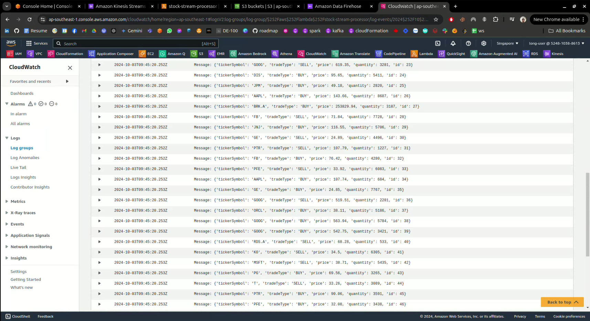

As you can see the system is always logged.

### 7.2. View Output
We move to the `bucket` used as the `destination` of the `Firehose Stream` to harvest the results.


Then we continue to move through the folders `2024/`, `10/`, `03/`,... these folders represent the year, month and day that the result was created. Finally we will see the output file.


We download the file to see the results inside.


After downloading, we will open it to see the results.

<div style="text-align: center;">
    
</div>
<div style="text-align: center;">
    
</div>

## 8. 🗑 Clean Up
### 8.1. Delete Lambda Function
In the `Amazon Lambda` console, navigate to `Functions`, then select the previously used `function` and click `Delete`.

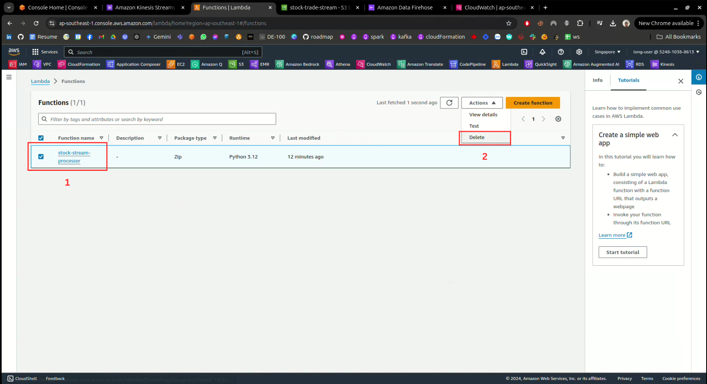

Enter `delete` to confirm deletion and then click `Delete`.

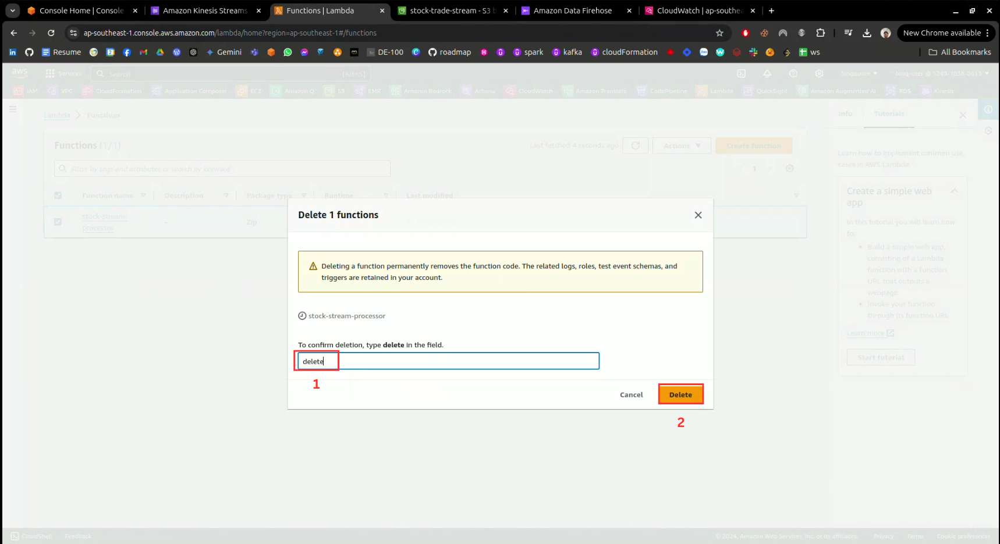

### 8.2. Delete Kinesis Data Firehose
In the `Amazon Data Firehose` console, select the `Firehose streams` you created and click `delete`.


Enter `Firehose stream name` to confirm deletion, then click `Delete`.

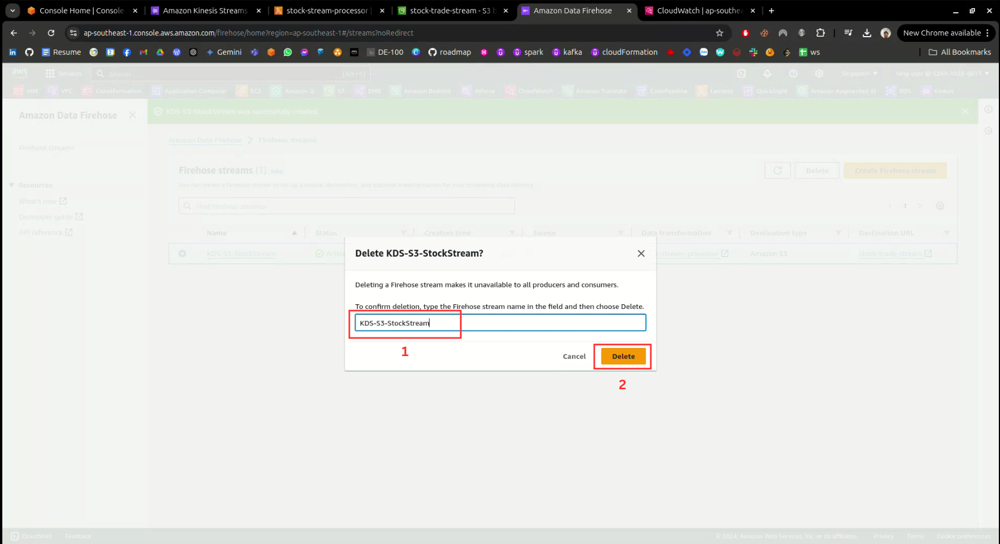

### 8.3. Delete Kinesis Data Streams
In the `Amazon kinesis streams` console, select the created `Data streams` and click `Delete`.

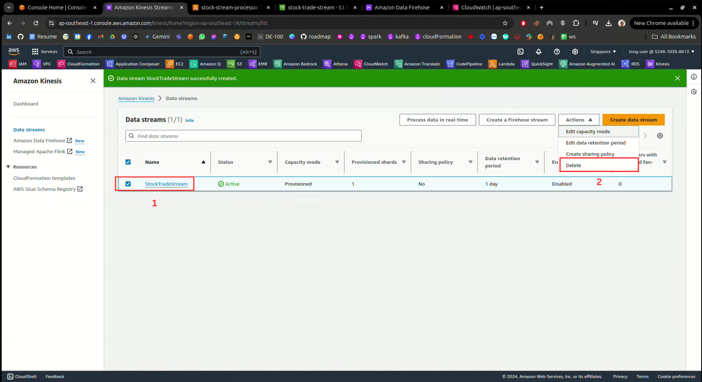

Enter `delete` to confirm deletion and then click `Delete`.

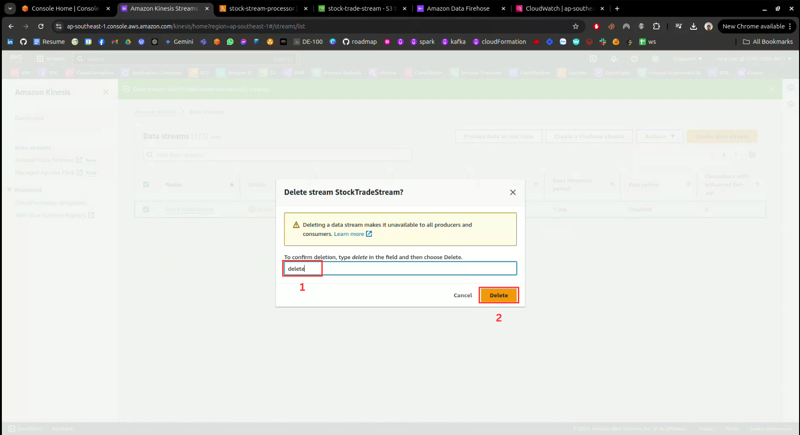

### 8.4. Delete S3 Bucket
In the `Amazon Lambda` console, we navigate to `Buckets`, then select the previously used `bucket`. Click `Empty` to delete the `content` inside the `bucket`.

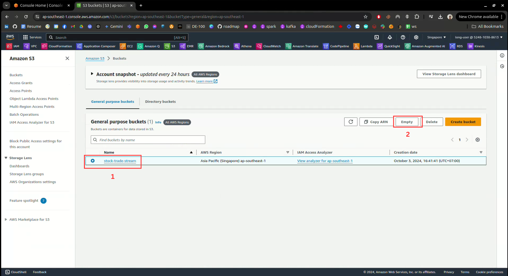

Then enter `permanently delete` to confirm deletion, then click `Empty` again to `delete` the `content`.

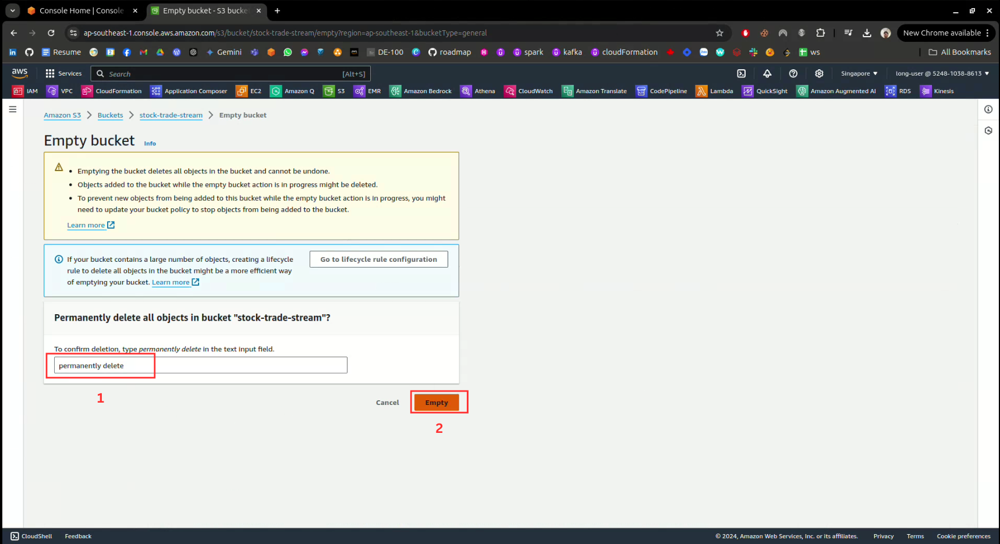

Continue to select that `bucket` and press `Delete`.

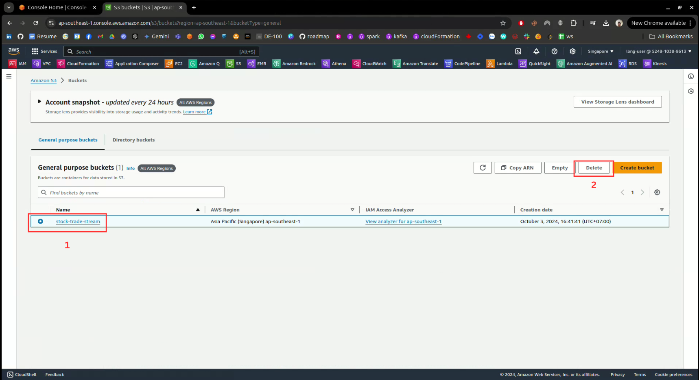

Enter the `bucket name` to confirm deletion, then select `Delete bucket` to delete.

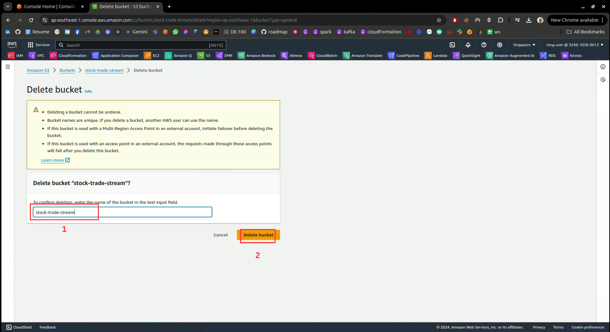

### 8.5. Delete Log groups
In the `Amazon CloudWatch` console, navigate to `Log groups`, then select all `Log group`. Next click `Delete log group(s)`.

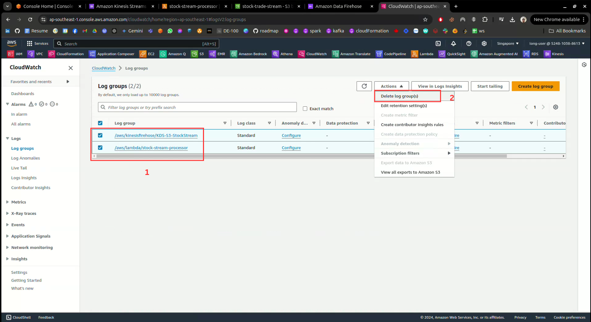

Finally click `Delete`.

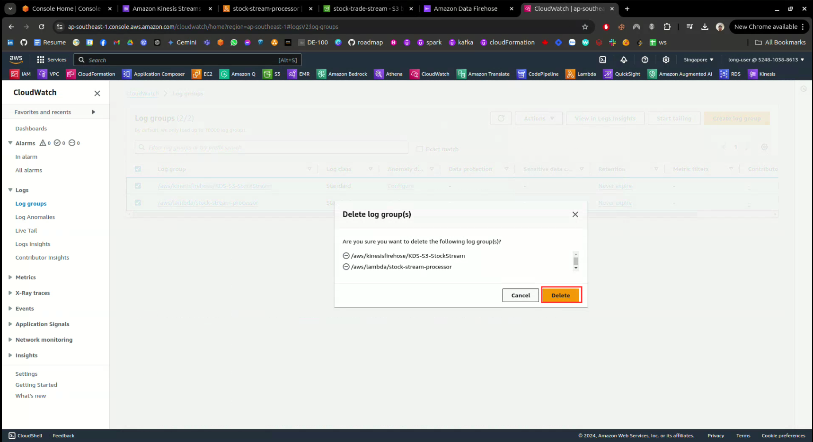
