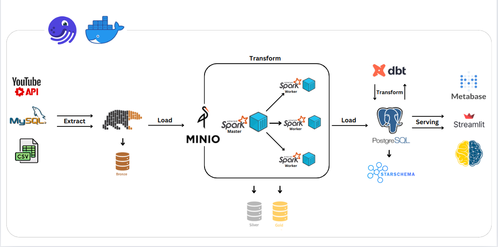
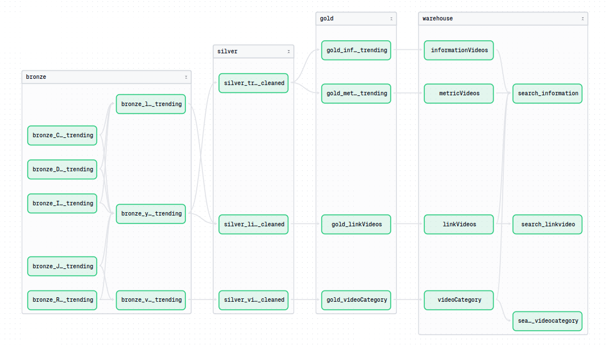
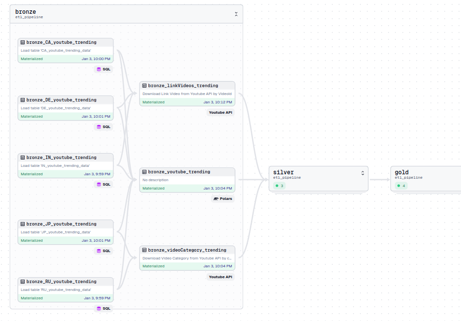
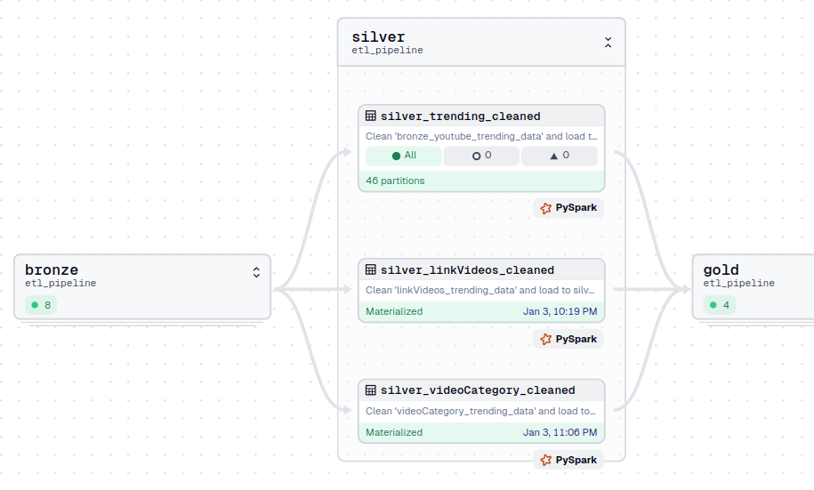
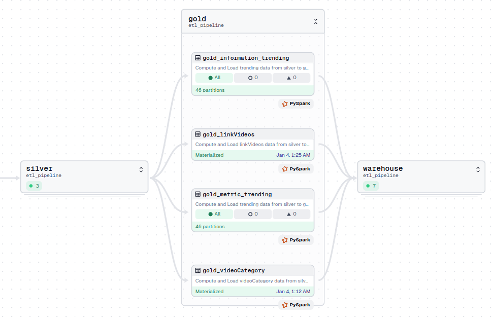
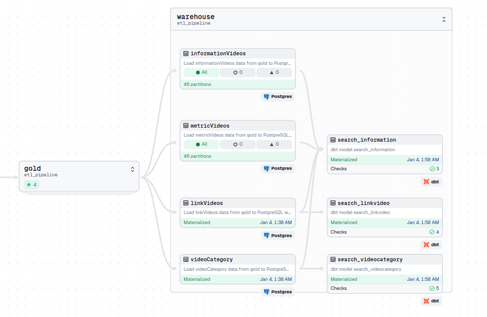
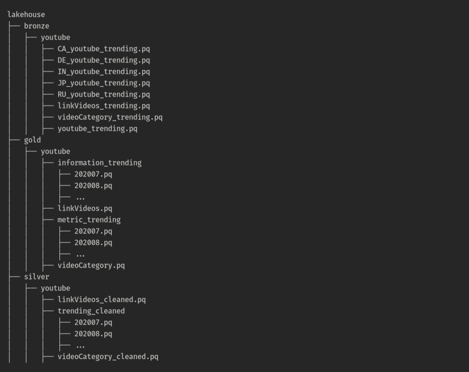

Trong project này, mình xây dựng một Data Pipeline đơn giản theo kiến trúc Lambda, sử dụng mô hình ETL(extract - Transform - Load) và bộ dữ liệu Youtube-Trending-Video. Thực hiện Ingestion, Processing, Transformation và Compute dữ liệu bằng công nghệ dữ liệu lớn Apache Spark, phục vụ hệ thống Recommendation Video cho bản thân.

Mã nguồn dự án được công khai trên GitHub tại: **[GitHub Repository](https://github.com/longNguyen010203/Youtube-Recommend-Master-ETL-Pipeline)**

  📹 Demo Video

<video style="width: 100%; height: auto;" controls>
  <source src="demo-2.webm" type="video/webm">
</video>

## 1. Project Overview
### 1.1 Objective

Mục tiêu của dự án này là xây dựng một đường ống dữ liệu ETL mạnh mẽ để hỗ trợ hệ thống gợi ý video cá nhân hóa cho YouTube. Bằng cách trích xuất, chuyển đổi và tải hiệu quả dữ liệu tương tác quy mô lớn của người dùng, hệ thống sẽ phân tích các mô hình xem, sở thích và các chỉ số tương tác. Mục đích cuối cùng là cung cấp các gợi ý video chính xác, phù hợp và kịp thời, nhằm nâng cao sự hài lòng của người dùng và mức độ tương tác trên nền tảng.

Hiện tại, hệ thống gợi ý video hoạt động dựa trên các thẻ (tags), loại video, và các tiêu chí cơ bản khác để đưa ra đề xuất. Trong tương lai, hệ thống sẽ được cải tiến và nâng cấp để tích hợp các mô hình gợi ý tiên tiến hơn, chẳng hạn như **Collaborative Filtering**, **Content-Based Filtering** hoặc các mô hình học sâu như **Neural Collaborative Filtering** và **Recurrent Neural Networks (RNNs)**. Điều này sẽ giúp hệ thống hiểu sâu hơn về hành vi và sở thích của người dùng, từ đó cung cấp các gợi ý chính xác và cá nhân hóa hơn, đáp ứng nhu cầu ngày càng cao của người dùng.

### 1.2 Importance

Hệ thống gợi ý video giúp cải thiện trải nghiệm người dùng, tăng mức độ tương tác và hỗ trợ khám phá nội dung dễ dàng hơn. Việc triển khai các công nghệ gợi ý tiên tiến trong tương lai không chỉ tối ưu hóa việc phân phối nội dung mà còn gia tăng giá trị cho cả người dùng lẫn nền tảng trong môi trường cạnh tranh số.

## 2. Data Description

Dataset **[YouTube Trending Video](https://www.kaggle.com/datasets/rsrishav/youtube-trending-video-dataset)** được lấy từ **[Kaggle](https://www.kaggle.com/)** bao gồm các tập dữ liệu video trending trên **Youtube** của các quốc gia như USA, Japan, Germany, Canada, France, Russia, Brazil, Mexico,...

YouTube (trang web chia sẻ video nổi tiếng thế giới) duy trì danh sách các video thịnh hành hàng đầu trên nền tảng này. Theo tạp chí Variety, "Để xác định các video thịnh hành hàng đầu trong năm, YouTube sử dụng kết hợp nhiều yếu tố bao gồm đo lường tương tác của người dùng (số lượt xem, chia sẻ, bình luận và lượt thích). Lưu ý rằng chúng không phải là những video được xem nhiều nhất trong năm dương lịch". Những video có lượt xem cao nhất trong danh sách thịnh hành của YouTube là các video ca nhạc (chẳng hạn như "Gangam Style" nổi tiếng nam tính), các buổi biểu diễn của người nổi tiếng và/hoặc chương trình truyền hình thực tế và các video lan truyền ngẫu nhiên về anh chàng cầm máy ảnh mà YouTube nổi tiếng.

Bộ dữ liệu này là bản ghi hàng ngày về các video thịnh hành nhất trên YouTube.

Bộ dữ liệu này được thu thập bằng cách sử dụng YouTube API.

Dữ liệu của mỗi quốc gia nằm trong một tệp riêng. Dữ liệu bao gồm tiêu đề video, tiêu đề kênh, thời gian xuất bản, thẻ, lượt xem, lượt thích và không thích, mô tả và số lượng bình luận và bao gồm các biến khác:

 - **video_id**: ID duy nhất đại diện cho một video trên nền tảng.
 - **title**: Tiêu đề của video.
 - **publishedAt**: Ngày và giờ mà video được xuất bản (theo múi giờ UTC).
 - **channelId**: ID duy nhất đại diện cho kênh đăng tải video.
 - **channelTitle**: Tên kênh đăng tải video.
 - **categoryId**: Mã số đại diện cho danh mục của video (thể loại nội dung).
 - **trending_date**: Ngày mà video trở nên phổ biến (xuất hiện trong danh sách xu hướng).
 - **tags**: Danh sách các thẻ (tags) liên quan đến nội dung video.
 - **view_count**: Số lượt xem video.
 - **likes**: Số lượt thích video.
 - **dislikes**: Số lượt không thích video (có thể không còn được hiển thị trên YouTube từ năm 2021).
 - **comment_count**: Số lượng bình luận trên video.
 - **thumbnail_link**: URL dẫn đến hình ảnh thu nhỏ (thumbnail) đại diện cho video.
 - **comments_disabled**: Biến boolean (True/False) cho biết bình luận trên video có bị tắt không.
 - **ratings_disabled**: Biến boolean (True/False) cho biết lượt thích và không thích có bị tắt không.
 - **description**: Mô tả chi tiết về video, do người tạo nội dung cung cấp.

## 3. Design

### 3.1. System Architecture

1. Sử dụng `Docker` để tạo môi trường và đóng gói ứng dụng.
2. Sử dụng `Dagster` để điều phối assets (theo [định nghĩa](https://docs.dagster.io/concepts/assets/software-defined-assets) của dagster).
3. Dữ liệu `YouTube Trending Video` được download từ `kaggle` dưới dạng `.csv`, sau đó import vào MySQL mô phỏng dữ liệu nguồn.
4. Sau khi có thông tin `video_id` (ID duy nhất đại diện cho một video trên nền tảng) và `categoryId` (Mã số đại diện cho danh mục của video (thể loại nội dung)), tiến hành collect các thông tin cần thiết khác từ **YouTube API**.
    
    - `link_video` (Đường dẫn trực tiếp để truy cập video) bằng **video_id**.
    - `categoryName` (Tên danh mục của video) bằng **categoryId**.

5. Extract dữ liệu dạng bảng ở trên bằng `Polars`, load vào datalake - `MinIO` (layer bronze).
6. Từ `MinIO` load ra `Spark` để transform tạo ra layer silver và gold.
7. Sau khi transform bằng Spark xong ta convert dữ liệu từ `Spark DataFrame` sang định dạng `.parquet` và load lại vào `MinIO`.
8. Gold layer được load tiếp vào data warehouse - `PostgreSQL`, tạo thành warehouse layer.
9. Transform tùy mục đích bằng `dbt` trên nền `Postgres`.
10. Trực quan hóa dữ liệu bằng `Metabase`.
11. Giao diện app gợi ý sách bằng `Streamlit`.

### 3.2. Data Lineage

#### 3.2.1. Overview

Với `Data Lineage` dày đặc, `dagster` là một giải pháp tốt khi có thể visualize chúng một cách rõ ràng:

 - Dữ liệu xuất phát từ **MySQL** và **Youtube API**, load vào bronze layer.
 - Từ bronze layer, dữ liệu được **Clean**, **Normalization** và **Fill Missing** ở silver layer.
 - Sau đó **tính toán nâng cao** và **phân tách** ở gold layer.
 - Cuối cùng transform theo nhu cầu với dbt và Load vào data warehouse - Postgres ở warehouse layer.
 - Dagster cho phép nhóm các assets thành các group, giúp ta:

   - Tổ chức và quản lý tốt hơn
   - Phân chia và phân quyền
   - Cải thiện khả năng quan sát

#### 3.2.2. Bronze Layer

Gồm các assets:

   -  **bronze_CA_youtube_trending**: Extract bảng dữ liệu trending của khu vực `Canada`.
   -  **bronze_DE_youtube_trending**: Extract bảng dữ liệu trending của khu vực `Germany`.
   -  **bronze_IN_youtube_trending**: Extract bảng dữ liệu trending của khu vực `India`.
   -  **bronze_JP_youtube_trending**: Extract bảng dữ liệu trending của khu vực `Japan`.
   -  **bronze_RU_youtube_trending**: Extract bảng dữ liệu trending của khu vực `Russia`.
   -  **bronze_linkVideos_trending**: Đảm nhận việc kết nối tới YouTube API, collect `video_id` từ các bảng dữ liệu của các khu vực trên và thực hiện kéo `link_video` về , lưu trong datalake.
   -  **bronze_youtube_trending**: Integration data từ các bảng dữ liệu của các khu vực trên.
   -  **bronze_videoCategory_trending**: Đảm nhận việc kết nối tới YouTube API, collect `categoryId` từ các bảng dữ liệu của các khu vực trên và thực hiện kéo `categoryName` về , lưu trong datalake.

#### 3.2.3. Silver Layer

Gồm các assets:

   - **silver_trending_cleaned**: Clean data từ upstream `bronze_youtube_trending`, được partition để đảm bảo `spark standalone mode` có thể chạy (do chứa dữ liệu lớn).
   - **silver_linkVideos_cleaned**: Clean data được collect từ upstream `bronze_linkVideos_trending` và join với `video_id` của upstream `bronze_youtube_trending`
   - **silver_videoCategory_cleaned**: Clean data được collect từ upstream `bronze_videoCategory_trending` gồm id, name của category.

#### 3.2.4. Gold Layer

Gồm các assets:

   - **gold_information_trending**: Bảng dữ liệu được tách ra từ upstream `silver_trending_cleaned` chứa các thông tin về title, channelTitle, tags, ratings_disabled, comments_disabled,... Và được partitions để đảm bảo `spark standalone mode` có thể chạy.
   - **gold_linkVideos**: Bảng data chứa hai thông tin gồm `video_id` và `link_video`. Từ upstream `silver_linkVideos_cleaned`.
   - **gold_metric_trending**: Bảng dữ liệu được tách ra từ upstream `silver_trending_cleaned` chứa các chỉ số của video gồm view_count, likes, dislikes, comment_count,... Và được partitions để đảm bảo `spark standalone mode` có thể chạy.
   - **gold_videoCategory**: Bảng data chứa hai thông tin gồm `categoryId` và `categoryName`. Từ upstream `silver_videoCategory_cleaned`.

#### 3.2.5. Warehouse Layer

Gồm các assets:

   - **informationVideos**: Load dữ liệu từ asset `gold_information_trending`.
   - **metricVideos**: Load dữ liệu từ asset `gold_metric_trending`.
   - **linkVideos**: Load dữ liệu từ asset `gold_linkVideos`.
   - **videoCategory**: Load dữ liệu từ asset `gold_videoCategory`.
   - **search_information**: Transform thông tin để tạo bảng index, khi người dùng tìm kiếm các thông tin cơ bản của video sẽ query trên bảng này.
   - **search_linkvideo**: Transform thông tin để tạo bảng index, khi người dùng tìm kiếm các thông tin về cả video.
   - **search_videocategory**: Transform thông tin để tạo bảng index, khi người dùng tìm kiếm các thông tin về cả category.

### 3.3. Datalake Structure 

1. Datalake chia theo các Layer: Bronze, Silver, Gold

    - **bronze layer**: chứa dữ liệu thô.
    - **silver layer**: chứa dữ liệu đã được làm sạch.
    - **gold layer**: chứa dữ liệu được tính toán và phân tách.

2. Các file đều ở dạng .parquet để giúp cho việc đọc và nén dữ liệu tốt hơn định dạng .csv

## 4. Crawler Data Process Description
## 5. Setup Infrastructure

## 6. Technical Details
## 7. Challenges